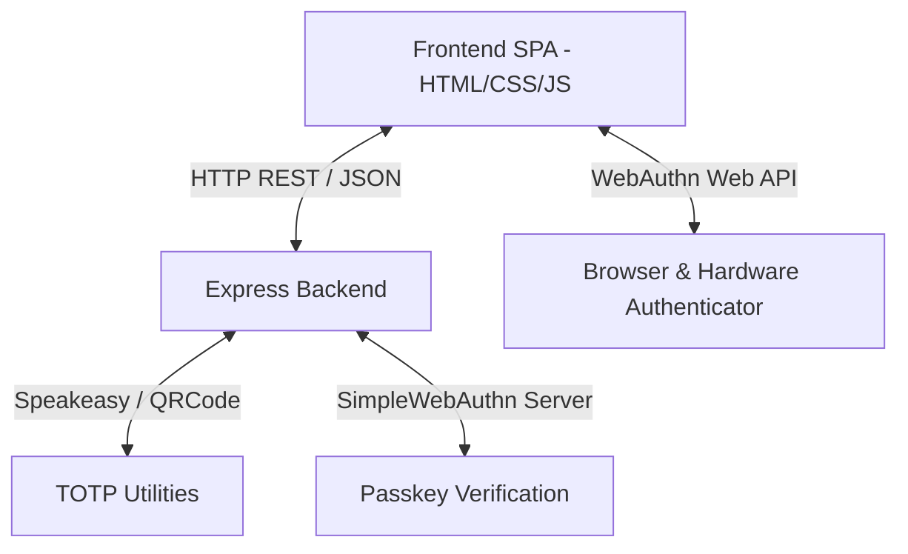
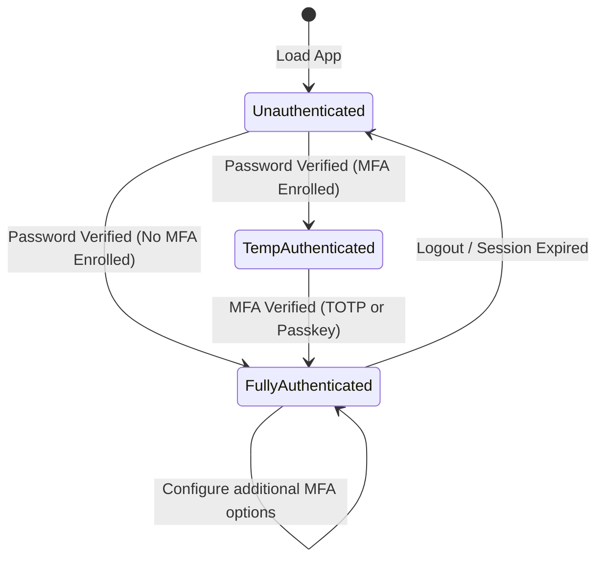
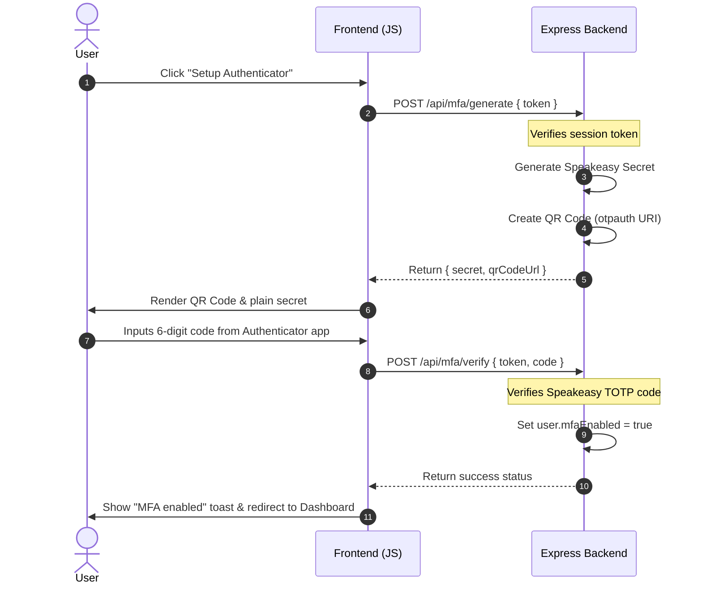
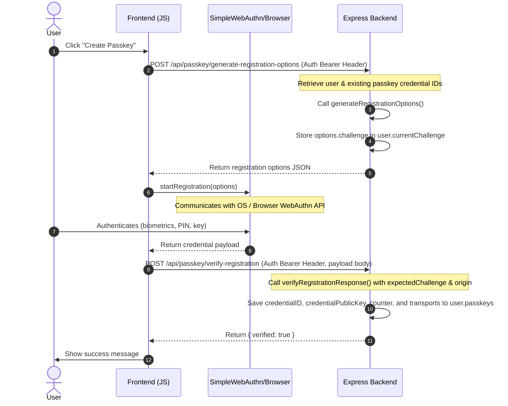

# MFA (Multi-Factor Authentication) Demo Application

This project is a complete demonstration of adding multi-factor authentication (MFA) to a standard password-based sign-in flow. It supports two MFA mechanisms:
1. **TOTP (Time-based One-Time Password)** via Authenticator apps (e.g., Google Authenticator, Authy).
2. **Passkeys (WebAuthn)** for cryptographic biometrics/security keys (e.g., Touch ID, Face ID, YubiKeys) acting as a second factor.

---

## 🏗️ Architecture

The application is structured as a single-page application (SPA) frontend served by a local Node.js Express server. It implements a state-driven authentication flow with strict transition checks.

### 1. Key Component Interactions



### 2. In-Memory Data Store

To keep the project self-contained and run-ready, the backend utilizes in-memory JavaScript objects as a data store.

*   `users`: Stores user credential and security profiles keyed by username:
    ```javascript
    users[username] = {
        id: "base64url-uuid",          // Cryptographically secure user ID
        password: "raw_password",      // User password (in production, always hashed!)
        mfaEnabled: false,             // Flag showing if TOTP is completed & verified
        mfaSecret: "BASE32SECRET",     // Generated Speakeasy TOTP secret
        currentChallenge: "challenge", // Active WebAuthn challenge for registration/auth
        passkeys: [                    // Array of enrolled passkey credentials
            {
                credentialID: Uint8Array,
                credentialPublicKey: Uint8Array,
                counter: number,
                transports: string[]
            }
        ]
    }
    ```
*   `sessions`: Map of active, fully authenticated tokens to usernames:
    ```javascript
    sessions[token] = username;
    ```
*   `tempSessions`: Map of temporary tokens issued after correct password entry, but prior to completing MFA:
    ```javascript
    tempSessions[tempToken] = username;
    ```

### 3. Session State Transitions

The application controls access by transitioning clients through three specific states:



*   **Unauthenticated**: The client has no session tokens. Access to the dashboard or security settings is blocked.
*   **TempAuthenticated (Temporary Session)**: The user entered the correct password, but has active MFA (TOTP or Passkeys) enrolled. The server responds with `requireMfa: true` and a `tempToken`. The client can only use this `tempToken` to submit MFA verification.
*   **FullyAuthenticated**: The user has bypassed/completed MFA. The server returns a permanent `token`. This token is stored in the browser's `localStorage` and sent in the `Authorization: Bearer <token>` header for subsequent dashboard API operations.

---

## 🔄 Code Flow Details

### 1. Registration Flow
1. User enters `username` and `password` on the UI and clicks **Register**.
2. Frontend sends `POST /api/register` with `{ username, password }`.
3. Backend validates uniqueness, initializes the user object with `mfaEnabled: false`, empty `passkeys` array, and generates a random unique `id` via crypto.

### 2. Login Flow (First Factor & Redirect)
1. User submits `username` and `password` via `POST /api/login`.
2. Backend checks the credentials:
    *   **Invalid Credentials**: Returns `401 Unauthorized`.
    *   **Valid Credentials & MFA Enrolled** (`user.mfaEnabled || user.passkeys.length > 0`):
        *   Backend creates a `tempToken` and registers it in `tempSessions`.
        *   Backend returns `{ requireMfa: true, tempToken, hasTotp: bool, hasPasskey: bool }`.
        *   Frontend captures the parameters and redirects the user to the **Security Check** view, showing inputs only for their enrolled factors.
    *   **Valid Credentials & NO MFA Enrolled**:
        *   Backend generates a permanent session `token` and registers it in `sessions`.
        *   Backend returns `{ requireMfa: false, token }`.
        *   Frontend stores the token and redirects the user to the **Security Setup Options** view to mandate or recommend enrolling in MFA.

---

### 3. TOTP Multi-Factor Authentication Flow

#### A. Setup / Enrollment Phase


#### B. Verification Phase (During Login)
1. User has entered correct password, frontend has `tempToken` from the login response.
2. User enters the 6-digit code from their Authenticator app.
3. Frontend sends `POST /api/mfa/verify` containing `{ tempToken, code }`.
4. Backend checks if `tempToken` matches an entry in `tempSessions`:
    *   Retrieves the username and uses `speakeasy.totp.verify` with the user's `mfaSecret`.
    *   **Valid Code**:
        *   Deletes the `tempToken` from `tempSessions`.
        *   Generates a new permanent session `token`, stores it in `sessions`.
        *   Returns `{ token }`.
        *   Frontend saves the token to `localStorage` and loads the Dashboard.

---

### 4. Passkey (WebAuthn) Multi-Factor Authentication Flow

This flow uses cryptographic credentials as a secondary authentication factor.

#### A. Setup / Enrollment Phase


#### B. Verification Phase (During Login)
1. User enters credentials, backend requires MFA and indicates `hasPasskey: true` alongside a `tempToken`.
2. User clicks **Use Passkey / Biometrics**.
3. Frontend requests authentication options: `POST /api/passkey/generate-authentication-options` with `{ tempToken }`.
4. Backend verifies the `tempToken` in `tempSessions`, grabs the user's registered passkey credentials, calls `generateAuthenticationOptions()`, stores the challenge in `user.currentChallenge`, and sends the options back.
5. Frontend calls `SimpleWebAuthnBrowser.startAuthentication(optionsData)`. The browser prompts the user for Touch ID/Face ID/security key authentication.
6. Frontend sends the authenticator assertion response back to the backend: `POST /api/passkey/verify-authentication` with `{ tempToken, response }`.
7. Backend:
    *   Finds the user matching the `tempToken` session.
    *   Matches the credential ID from the response with the stored public key.
    *   Calls `verifyAuthenticationResponse()` using the stored public key, counter, expected challenge, and origin.
    *   **Verified**: Updates the credential counter (to prevent replay attacks), invalidates `tempToken`, generates a permanent session `token`, and returns `{ verified: true, token }`.
    *   Frontend saves the token to `localStorage` and redirects to the Dashboard.

---

## 🔒 Security Enforcement

*   **Endpoint Protection (`/api/dashboard`)**:
    The dashboard check goes beyond session validation:
    ```javascript
    const user = users[username];
    if (!user.mfaEnabled && user.passkeys.length === 0) {
        return res.status(403).json({ error: 'MFA not configured. Must enable TOTP or Passkey to view dashboard.' });
    }
    ```
    Even if a user possesses a valid session token, they will be blocked from accessing protected resources if they have not completed enrollment of at least one MFA mechanism.
*   **WebAuthn Counter Verification**:
    The backend stores the credential signature `counter` and verifies it during authentication. If the incoming counter value is not greater than the stored counter, it alerts the system of potential authenticator cloning or replay attacks.

---

## 🚀 Running the Application Locally

1. Install dependencies inside the backend folder:
   ```bash
   cd backend
   npm install
   ```
2. Start the server:
   ```bash
   node server.js
   ```
3. Open [http://localhost:3000](http://localhost:3000) in your web browser.
