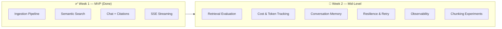

# RAG Chatbot — Mid-Level Enhancement Plan

> **Prerequisite**: Complete the 1-week MVP from [PROJECT_PLAN.md](./PROJECT_PLAN.md) first.
> **Timeline**: 3–5 extra days after MVP
> **Goal**: Elevate the project from "junior demo" to "mid-level production-aware" system

---

## Why This Matters

Most candidates applying for **AI Backend / AI Infra** roles build a simple RAG wrapper:

```
question → OpenAI → answer
```

Mid-level engineers are expected to think about:

- **How do you know retrieval quality is good?** → Evaluation
- **How much does each request cost?** → Cost tracking
- **What happens when OpenAI is down?** → Resilience
- **Can users ask follow-up questions?** → Conversation memory
- **How do you measure system health?** → Observability

This plan adds exactly those capabilities.

---

## Enhancement Overview



---

## Enhancement 1 — Retrieval Quality Evaluation

> **This is the #1 thing that separates juniors from mid-level in RAG systems.**

### Why

If you can't measure retrieval quality, you can't improve it. Every production RAG system has an evaluation pipeline.

### What to build

#### 1.1 Test dataset (`eval/testcases.json`)

Create 10–15 test cases with expected results:

```json
[
  {
    "id": "tc-001",
    "question": "What is the refund policy for delivery orders?",
    "expected_documents": ["refund-policy.pdf"],
    "expected_pages": [12, 13],
    "expected_keywords": ["refund", "delivery", "3 business days"]
  },
  {
    "id": "tc-002",
    "question": "How to handle customer complaints?",
    "expected_documents": ["customer-service-handbook.pdf"],
    "expected_pages": [5, 6, 7],
    "expected_keywords": ["complaint", "escalation", "manager"]
  }
]
```

#### 1.2 Evaluation API

```http
POST /api/v1/eval/run
```

Response:

```json
{
  "total_cases": 10,
  "results": [
    {
      "test_id": "tc-001",
      "precision_at_5": 0.80,
      "recall": 1.0,
      "correct_doc_found": true,
      "correct_page_found": true,
      "top_chunk_score": 0.91,
      "latency_ms": 145
    }
  ],
  "summary": {
    "avg_precision_at_5": 0.76,
    "avg_recall": 0.90,
    "avg_latency_ms": 132,
    "doc_hit_rate": 0.90
  }
}
```

#### 1.3 Metrics to compute

| Metric | Formula | What it means |
|--------|---------|---------------|
| **Precision@K** | (relevant chunks in top-K) / K | How many retrieved chunks are actually useful |
| **Recall** | (relevant chunks found) / (total relevant chunks) | Did we find all the relevant information |
| **Doc Hit Rate** | (queries where correct doc in top-K) / total queries | Are we searching the right documents |
| **MRR** | 1 / rank_of_first_relevant_result | How high is the first relevant result ranked |

### Implementation

```go
// internal/service/evaluation.go

type EvalTestCase struct {
    ID                string   `json:"id"`
    Question          string   `json:"question"`
    ExpectedDocuments []string `json:"expected_documents"`
    ExpectedPages     []int    `json:"expected_pages"`
    ExpectedKeywords  []string `json:"expected_keywords"`
}

type EvalResult struct {
    TestID          string  `json:"test_id"`
    PrecisionAtK    float64 `json:"precision_at_k"`
    Recall          float64 `json:"recall"`
    CorrectDocFound bool    `json:"correct_doc_found"`
    CorrectPageFound bool   `json:"correct_page_found"`
    TopChunkScore   float64 `json:"top_chunk_score"`
    LatencyMs       int64   `json:"latency_ms"`
}

func (s *EvalService) RunEvaluation(ctx context.Context, topK int) (*EvalReport, error) {
    testCases := s.loadTestCases()
    var results []EvalResult

    for _, tc := range testCases {
        start := time.Now()
        chunks, err := s.retrievalService.Search(ctx, tc.Question, topK)
        latency := time.Since(start).Milliseconds()

        result := EvalResult{
            TestID:    tc.ID,
            LatencyMs: latency,
        }

        // Calculate precision@K
        relevant := 0
        for _, chunk := range chunks {
            if contains(tc.ExpectedDocuments, chunk.Filename) {
                relevant++
            }
        }
        result.PrecisionAtK = float64(relevant) / float64(len(chunks))

        // Check doc hit
        result.CorrectDocFound = relevant > 0

        results = append(results, result)
    }

    return s.buildReport(results), nil
}
```

### Files to create/modify

| File | Action |
|------|--------|
| `eval/testcases.json` | Create — test dataset |
| `internal/service/evaluation.go` | Create — eval logic |
| `internal/handler/eval.go` | Create — eval endpoint |
| `cmd/eval/main.go` | Create — CLI eval runner (optional) |

**Estimated time: 4–5h**

---

## Enhancement 2 — Cost & Token Tracking

### Why

AI API calls cost money. Production systems track cost per request, per user, per day. This is table-stakes for mid-level.

### What to build

#### 2.1 Cost calculator service

```go
// internal/service/cost.go

type CostCalculator struct {
    // Pricing per 1M tokens (as of 2026)
    prices map[string]ModelPricing
}

type ModelPricing struct {
    InputPer1M  float64 // USD per 1M input tokens
    OutputPer1M float64 // USD per 1M output tokens
}

type RequestCost struct {
    EmbeddingCost float64 `json:"embedding_cost_usd"`
    LLMInputCost  float64 `json:"llm_input_cost_usd"`
    LLMOutputCost float64 `json:"llm_output_cost_usd"`
    TotalCost     float64 `json:"total_cost_usd"`
}

var defaultPricing = map[string]ModelPricing{
    "text-embedding-3-small": {InputPer1M: 0.02, OutputPer1M: 0},
    "gpt-4.1-mini":           {InputPer1M: 0.40, OutputPer1M: 1.60},
}

func (c *CostCalculator) Calculate(embeddingTokens, llmInputTokens, llmOutputTokens int) RequestCost {
    return RequestCost{
        EmbeddingCost: float64(embeddingTokens) / 1_000_000 * c.prices["text-embedding-3-small"].InputPer1M,
        LLMInputCost:  float64(llmInputTokens) / 1_000_000 * c.prices["gpt-4.1-mini"].InputPer1M,
        LLMOutputCost: float64(llmOutputTokens) / 1_000_000 * c.prices["gpt-4.1-mini"].OutputPer1M,
    }
}
```

#### 2.2 Add cost to chat response

```json
{
  "answer": "...",
  "citations": [...],
  "token_usage": {
    "embedding_tokens": 15,
    "prompt_tokens": 850,
    "completion_tokens": 230
  },
  "cost": {
    "embedding_cost_usd": 0.0000003,
    "llm_input_cost_usd": 0.00034,
    "llm_output_cost_usd": 0.000368,
    "total_cost_usd": 0.000708
  },
  "latency_ms": 2300
}
```

#### 2.3 Daily cost aggregation (DB table)

```sql
-- 005_create_cost_tracking.up.sql
CREATE TABLE cost_tracking (
    id              UUID PRIMARY KEY DEFAULT gen_random_uuid(),
    request_type    VARCHAR(20) NOT NULL,   -- 'chat', 'search', 'embedding'
    model           VARCHAR(50) NOT NULL,
    input_tokens    INT NOT NULL,
    output_tokens   INT NOT NULL DEFAULT 0,
    cost_usd        DECIMAL(10, 8) NOT NULL,
    created_at      TIMESTAMPTZ NOT NULL DEFAULT NOW()
);

CREATE INDEX idx_cost_tracking_date ON cost_tracking(created_at);

-- Summary query
-- SELECT DATE(created_at) as day, SUM(cost_usd) as total_cost
-- FROM cost_tracking GROUP BY DATE(created_at) ORDER BY day DESC;
```

#### 2.4 Cost summary endpoint

```http
GET /api/v1/metrics/costs?from=2026-05-01&to=2026-05-19
```

```json
{
  "period": {"from": "2026-05-01", "to": "2026-05-19"},
  "total_cost_usd": 1.23,
  "total_requests": 156,
  "avg_cost_per_request_usd": 0.0079,
  "breakdown": {
    "embedding": 0.08,
    "llm": 1.15
  },
  "daily": [
    {"date": "2026-05-19", "cost_usd": 0.15, "requests": 22}
  ]
}
```

**Estimated time: 3–4h**

---

## Enhancement 3 — Conversation Memory

### Why

Without memory, each question is independent. Users expect follow-up questions to work:

```
User: "What is the refund policy?"
AI:   "The refund policy states that..."

User: "How long does it take?"        ← refers to "refund" from previous question
AI:   "Refunds are processed within 3 business days..."
```

### What to build

#### 3.1 Sliding window memory

Include the last N messages in the prompt:

```go
// internal/service/chat.go

func (s *ChatService) buildPromptWithMemory(
    ctx context.Context,
    question string,
    chunks []model.Chunk,
    sessionID uuid.UUID,
) []openai.ChatMessage {
    messages := []openai.ChatMessage{
        {Role: "system", Content: systemPrompt},
    }

    // Add context from retrieved chunks
    contextBlock := s.formatChunksAsContext(chunks)
    messages = append(messages, openai.ChatMessage{
        Role:    "system",
        Content: "Context:\n" + contextBlock,
    })

    // Add conversation history (last 6 messages = 3 Q&A pairs)
    if sessionID != uuid.Nil {
        history, _ := s.chatRepo.GetRecentMessages(ctx, sessionID, 6)
        for _, msg := range history {
            messages = append(messages, openai.ChatMessage{
                Role:    msg.Role,
                Content: msg.Content,
            })
        }
    }

    // Add current question
    messages = append(messages, openai.ChatMessage{
        Role:    "user",
        Content: question,
    })

    return messages
}
```

#### 3.2 Query rewriting (advanced)

Rewrite the user question to be self-contained before embedding:

```
Original: "How long does it take?"
Rewritten: "How long does the refund process take for delivery orders?"
```

```go
// Use LLM to rewrite ambiguous follow-up questions
func (s *ChatService) rewriteQuery(ctx context.Context, question string, history []model.ChatMessage) (string, error) {
    if len(history) == 0 {
        return question, nil // No history, no rewrite needed
    }

    prompt := fmt.Sprintf(`Given this conversation history, rewrite the follow-up question to be self-contained.
Only rewrite if the question references something from history. Otherwise return it unchanged.

History:
%s

Follow-up question: %s

Rewritten question:`, formatHistory(history), question)

    return s.llm.Complete(ctx, prompt)
}
```

**Estimated time: 3–4h**

---

## Enhancement 4 — Resilience & Error Recovery

### Why

External API calls (OpenAI) fail. Mid-level engineers handle this gracefully.

### What to build

#### 4.1 Retry with exponential backoff

```go
// internal/service/retry.go

type RetryConfig struct {
    MaxRetries  int
    BaseDelay   time.Duration
    MaxDelay    time.Duration
    RetryableErrors []int  // HTTP status codes to retry
}

var DefaultOpenAIRetry = RetryConfig{
    MaxRetries:      3,
    BaseDelay:       500 * time.Millisecond,
    MaxDelay:        10 * time.Second,
    RetryableErrors: []int{429, 500, 502, 503},
}

func WithRetry[T any](ctx context.Context, cfg RetryConfig, fn func() (T, error)) (T, error) {
    var lastErr error
    for attempt := 0; attempt <= cfg.MaxRetries; attempt++ {
        result, err := fn()
        if err == nil {
            return result, nil
        }

        lastErr = err
        if !isRetryable(err, cfg.RetryableErrors) {
            return result, err
        }

        delay := cfg.BaseDelay * time.Duration(1<<attempt)
        if delay > cfg.MaxDelay {
            delay = cfg.MaxDelay
        }

        log.Warn().
            Err(err).
            Int("attempt", attempt+1).
            Dur("retry_after", delay).
            Msg("retrying API call")

        select {
        case <-ctx.Done():
            return result, ctx.Err()
        case <-time.After(delay):
        }
    }
    var zero T
    return zero, fmt.Errorf("max retries exceeded: %w", lastErr)
}
```

#### 4.2 Timeout configuration

```go
// Per-service timeouts
type TimeoutConfig struct {
    EmbeddingTimeout time.Duration  // 10s
    LLMTimeout       time.Duration  // 30s
    SearchTimeout    time.Duration  // 5s
}
```

#### 4.3 Graceful degradation

When embedding fails → return error with clear message.
When LLM fails → return retrieved chunks without LLM answer:

```json
{
  "answer": null,
  "fallback": true,
  "fallback_reason": "LLM service unavailable",
  "relevant_chunks": [
    {"text": "...", "document": "refund-policy.pdf", "page": 12, "score": 0.89}
  ]
}
```

**Estimated time: 2–3h**

---

## Enhancement 5 — Observability (Prometheus Metrics)

### Why

Production AI systems need metrics. Token cost, latency, and queue health are unique to AI backends.

### What to build

#### 5.1 Key metrics

```go
// internal/middleware/metrics.go

var (
    httpRequestDuration = promauto.NewHistogramVec(
        prometheus.HistogramOpts{
            Name:    "http_request_duration_seconds",
            Help:    "HTTP request duration",
            Buckets: prometheus.DefBuckets,
        },
        []string{"method", "path", "status"},
    )

    embeddingLatency = promauto.NewHistogram(prometheus.HistogramOpts{
        Name:    "embedding_api_duration_seconds",
        Help:    "OpenAI embedding API call duration",
        Buckets: []float64{0.1, 0.25, 0.5, 1, 2, 5},
    })

    llmLatency = promauto.NewHistogram(prometheus.HistogramOpts{
        Name:    "llm_api_duration_seconds",
        Help:    "LLM API call duration",
        Buckets: []float64{0.5, 1, 2, 5, 10, 30},
    })

    tokenUsage = promauto.NewCounterVec(
        prometheus.CounterOpts{
            Name: "llm_token_usage_total",
            Help: "Total LLM token usage",
        },
        []string{"type"}, // "prompt", "completion"
    )

    retrievalScore = promauto.NewHistogram(prometheus.HistogramOpts{
        Name:    "retrieval_top_score",
        Help:    "Top retrieval score per query",
        Buckets: []float64{0.5, 0.6, 0.7, 0.8, 0.9, 0.95, 1.0},
    })

    documentsProcessed = promauto.NewCounterVec(
        prometheus.CounterOpts{
            Name: "documents_processed_total",
            Help: "Total documents processed",
        },
        []string{"status"}, // "success", "failed"
    )

    queueDepth = promauto.NewGauge(prometheus.GaugeOpts{
        Name: "worker_queue_depth",
        Help: "Current number of jobs in queue",
    })
)
```

#### 5.2 Metrics endpoint

```http
GET /metrics
```

Standard Prometheus format — scrappable by Prometheus + viewable in Grafana.

**Estimated time: 2–3h**

---

## Enhancement 6 — Chunking Strategy Experiments

### Why

Chunking is the most impactful factor in RAG quality. Being able to discuss trade-offs in interviews = mid-level signal.

### What to build

#### 6.1 Multiple chunking strategies

```go
// internal/chunker/strategies.go

type Strategy string

const (
    FixedToken    Strategy = "fixed_token"      // Current: 500 tokens, 100 overlap
    FixedSentence Strategy = "fixed_sentence"    // 5 sentences per chunk
    Paragraph     Strategy = "paragraph"         // Split by paragraph/heading
)

type ChunkerConfig struct {
    Strategy    Strategy
    ChunkSize   int  // tokens or sentences
    Overlap     int
}
```

#### 6.2 Comparison report

Run evaluation with each strategy, document results:

```
| Strategy        | Chunk Size | Precision@5 | Recall | Avg Latency |
|----------------|------------|-------------|--------|-------------|
| fixed_token    | 500/100    | 0.76        | 0.90   | 132ms       |
| fixed_token    | 300/50     | 0.82        | 0.85   | 128ms       |
| fixed_token    | 800/200    | 0.68        | 0.95   | 140ms       |
| fixed_sentence | 5 sent     | 0.74        | 0.88   | 135ms       |
```

Document your findings in the README:
- Smaller chunks → better precision, worse recall
- Larger chunks → better recall, worse precision
- Overlap prevents boundary issues

**Estimated time: 3–4h**

---

## Implementation Schedule

| Day | Focus | Hours | Key Deliverable |
|-----|-------|-------|-----------------|
| **Day 8** | Evaluation pipeline | 5h | `POST /api/v1/eval/run` working with test cases |
| **Day 9** | Cost tracking + Conversation memory | 5h | Cost per request in responses + follow-up questions work |
| **Day 10** | Resilience + Observability | 5h | Retry logic + `/metrics` endpoint |
| **Day 11** | Chunking experiments + README polish | 4h | Strategy comparison table + comprehensive README |
| **Day 12** | Buffer / polish / interview prep | 3h | Code cleanup, document design decisions |

---

## Interview Talking Points After Completing This

After completing these enhancements, you can confidently discuss:

### Retrieval Quality

> "I built an evaluation pipeline that measures precision@K and recall against a test dataset. When I experimented with different chunk sizes, I found that 300 tokens with 50 overlap gave better precision but lower recall. I chose 500/100 as the best trade-off for our document types."

### Cost Awareness

> "Each chat request costs approximately $0.0007 — $0.0003 for embedding and $0.0004 for LLM. I track this per-request and aggregate daily costs. For a team of 50 users making 20 queries/day, the monthly cost would be around $21."

### Production Resilience

> "I implemented exponential backoff retry for OpenAI API calls with max 3 retries. If the LLM is completely down, the system gracefully degrades to return raw relevant chunks instead of a generated answer."

### Observability

> "I track embedding latency, LLM latency, token usage, retrieval scores, and queue depth as Prometheus metrics. I can identify retrieval quality issues by monitoring the `retrieval_top_score` histogram — if scores drop below 0.7, it usually means the chunking strategy needs adjustment."

---

## Updated Project Structure

```
rag-chatbot/
├── cmd/
│   ├── api/main.go
│   ├── worker/main.go
│   └── eval/main.go               # NEW: CLI evaluation runner
│
├── internal/
│   ├── service/
│   │   ├── evaluation.go           # NEW: Retrieval evaluation
│   │   ├── cost.go                 # NEW: Cost calculator
│   │   └── retry.go                # NEW: Retry with backoff
│   │
│   ├── handler/
│   │   ├── eval.go                 # NEW: Eval endpoint
│   │   └── metrics.go              # NEW: Cost summary endpoint
│   │
│   ├── middleware/
│   │   └── prometheus.go           # NEW: Prometheus metrics
│   │
│   └── chunker/
│       ├── chunker.go
│       └── strategies.go           # NEW: Multiple chunking strategies
│
├── eval/
│   ├── testcases.json              # NEW: Test dataset
│   └── results/                    # NEW: Evaluation results
│
├── db/migrations/
│   └── 005_create_cost_tracking.up.sql  # NEW
│
└── docs/
    └── chunking_experiments.md     # NEW: Strategy comparison
```

---

## Checklist Summary

| # | Enhancement | Mid-level Signal | Est. Time | Priority |
|---|-------------|-----------------|-----------|----------|
| 1 | Retrieval evaluation | "Can you measure quality?" | 4–5h | 🔴 Must |
| 2 | Cost & token tracking | "How much does it cost?" | 3–4h | 🔴 Must |
| 3 | Conversation memory | "Can users ask follow-ups?" | 3–4h | 🟡 Should |
| 4 | Resilience & retry | "What if OpenAI is down?" | 2–3h | 🟡 Should |
| 5 | Observability (Prometheus) | "How do you monitor it?" | 2–3h | 🟡 Should |
| 6 | Chunking experiments | "Why this chunk size?" | 3–4h | 🟢 Nice |

**Total: ~18–23 hours (3–5 extra days)**
