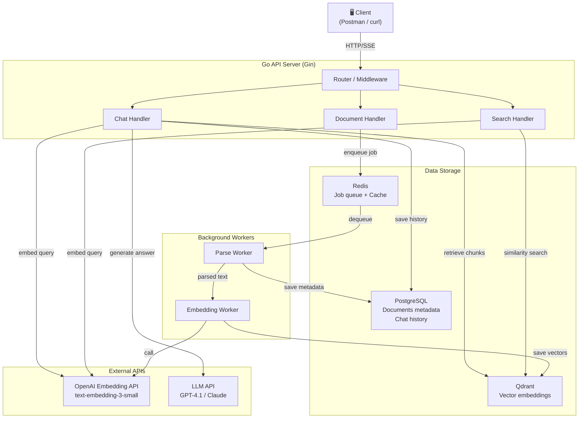
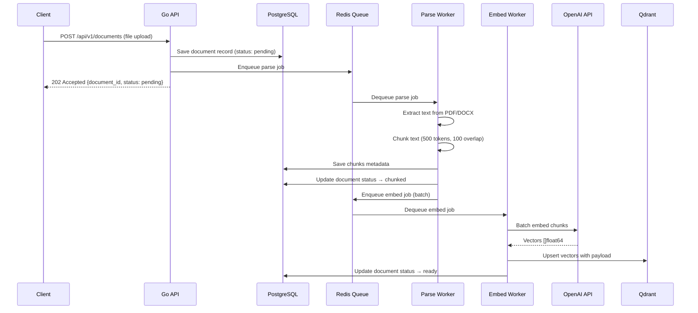
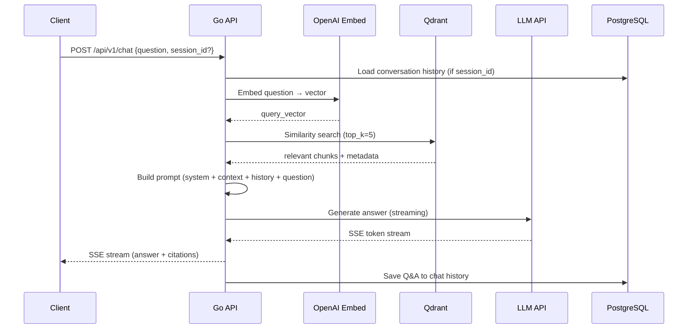

# RAG Chatbot AI Backend — Project Plan & Architecture

> **Goal**: Build a RAG (Retrieval-Augmented Generation) chatbot backend in Golang to understand the role of a backend engineer in AI product development.
> **Scope**: Learning project — focus on AI backend engineering depth, not production-grade auth/multi-tenancy.
> **Timeline**: 1 week (7 days)

---

## Table of Contents

- [1. Project Overview](#1-project-overview)
- [2. System Architecture](#2-system-architecture)
- [3. Technology Stack](#3-technology-stack)
- [4. Data Models & Schemas](#4-data-models--schemas)
- [5. API Contracts](#5-api-contracts)
- [6. Project Structure (Golang)](#6-project-structure-golang)
- [7. Implementation Roadmap](#7-implementation-roadmap)
- [8. Key Design Decisions](#8-key-design-decisions)
- [9. Learning Objectives](#9-learning-objectives)

---

## 1. Project Overview

### What is this?

An **Internal Document QA System** powered by RAG:

```
Upload PDF/DOCX → Chunk → Embed → Store in Qdrant → User asks question → Retrieve relevant chunks → LLM answers with citations
```

### What you will NOT do (to keep it simple)

- ❌ Train or fine-tune any AI model
- ❌ Build a production-grade auth system (use simple API key)
- ❌ Multi-tenant architecture
- ❌ Frontend (use Postman/curl or simple Swagger UI)
- ❌ Kubernetes deployment

### What you WILL deeply understand

- ✅ Document ingestion pipeline (parse → chunk → embed → index)
- ✅ Vector database operations (Qdrant)
- ✅ Retrieval pipeline (semantic search, top-k)
- ✅ LLM orchestration (prompt engineering, streaming)
- ✅ Citation system
- ✅ Background job processing
- ✅ Async worker architecture
- ✅ Observability for AI systems

---

## 2. System Architecture

### High-Level Architecture



### Request Flow — Document Upload



### Request Flow — Chat Query



---

## 3. Technology Stack

| Layer | Technology | Why |
|-------|-----------|-----|
| **HTTP Server** | Gin | Mature, fast, great middleware ecosystem |
| **Background Jobs** | Asynq (Redis-based) | Simple, reliable, built for Go |
| **Vector DB** | Qdrant | Purpose-built for vector search, great Go client |
| **Embedding** | OpenAI `text-embedding-3-small` | Cost-effective, 1536 dimensions, high quality |
| **LLM** | OpenAI GPT-4.1-mini (primary) | Fast, cheap, good enough for RAG |
| **PDF Parsing** | `pdfcpu` + `unipdf` | Pure Go PDF text extraction |
| **DOCX Parsing** | `unioffice` | Pure Go DOCX support |
| **RDBMS** | PostgreSQL | Metadata, chat history, document records |
| **Cache/Queue** | Redis | Asynq backend + embedding cache |
| **ORM** | sqlc | Type-safe SQL, no magic, Go-idiomatic |
| **Migration** | golang-migrate | Simple, file-based migrations |
| **Config** | Viper | Env + config file support |
| **Logging** | zerolog | Structured JSON logging |
| **Container** | Docker + docker-compose | Local dev environment |

---

## 4. Data Models & Schemas

### PostgreSQL Schema

```sql
-- 001_create_documents.up.sql
CREATE TABLE documents (
    id          UUID PRIMARY KEY DEFAULT gen_random_uuid(),
    filename    VARCHAR(500) NOT NULL,
    file_size   BIGINT NOT NULL,
    file_type   VARCHAR(20) NOT NULL,          -- 'pdf', 'docx'
    status      VARCHAR(20) NOT NULL DEFAULT 'pending',
                -- pending → parsing → chunked → embedding → ready → failed
    chunk_count INT DEFAULT 0,
    error_msg   TEXT,
    created_at  TIMESTAMPTZ NOT NULL DEFAULT NOW(),
    updated_at  TIMESTAMPTZ NOT NULL DEFAULT NOW()
);

CREATE INDEX idx_documents_status ON documents(status);

-- 002_create_chunks.up.sql
CREATE TABLE chunks (
    id            UUID PRIMARY KEY DEFAULT gen_random_uuid(),
    document_id   UUID NOT NULL REFERENCES documents(id) ON DELETE CASCADE,
    chunk_index   INT NOT NULL,
    content       TEXT NOT NULL,
    page_number   INT,
    token_count   INT NOT NULL,
    qdrant_id     UUID,                        -- reference to Qdrant point ID
    created_at    TIMESTAMPTZ NOT NULL DEFAULT NOW()
);

CREATE INDEX idx_chunks_document_id ON chunks(document_id);

-- 003_create_chat_sessions.up.sql
CREATE TABLE chat_sessions (
    id          UUID PRIMARY KEY DEFAULT gen_random_uuid(),
    title       VARCHAR(500),                  -- auto-generated from first question
    created_at  TIMESTAMPTZ NOT NULL DEFAULT NOW(),
    updated_at  TIMESTAMPTZ NOT NULL DEFAULT NOW()
);

-- 004_create_chat_messages.up.sql
CREATE TABLE chat_messages (
    id              UUID PRIMARY KEY DEFAULT gen_random_uuid(),
    session_id      UUID NOT NULL REFERENCES chat_sessions(id) ON DELETE CASCADE,
    role            VARCHAR(20) NOT NULL,       -- 'user' | 'assistant'
    content         TEXT NOT NULL,
    citations       JSONB,                      -- [{document: "...", page: 12}]
    token_usage     JSONB,                      -- {prompt_tokens, completion_tokens}
    latency_ms      INT,                        -- response time tracking
    created_at      TIMESTAMPTZ NOT NULL DEFAULT NOW()
);

CREATE INDEX idx_chat_messages_session_id ON chat_messages(session_id);
```

### Qdrant Collection Schema

```json
{
  "collection_name": "documents",
  "vectors": {
    "size": 1536,
    "distance": "Cosine"
  },
  "payload_schema": {
    "document_id": "keyword",
    "filename": "keyword",
    "page_number": "integer",
    "chunk_index": "integer",
    "text": "text"
  }
}
```

**Point structure:**

```json
{
  "id": "uuid",
  "vector": [0.012, -0.034, ...],
  "payload": {
    "document_id": "abc-123",
    "filename": "refund-policy.pdf",
    "page_number": 12,
    "chunk_index": 4,
    "text": "The refund policy for delivery orders states that..."
  }
}
```

---

## 5. API Contracts

### Base URL: `/api/v1`

### 5.1 Document Management

#### Upload Document

```http
POST /api/v1/documents
Content-Type: multipart/form-data

file: <binary>
```

**Response (202 Accepted):**
```json
{
  "id": "550e8400-e29b-41d4-a716-446655440000",
  "filename": "refund-policy.pdf",
  "file_size": 245760,
  "file_type": "pdf",
  "status": "pending",
  "created_at": "2026-05-19T10:00:00Z"
}
```

#### List Documents

```http
GET /api/v1/documents?status=ready&page=1&limit=20
```

**Response (200):**
```json
{
  "data": [
    {
      "id": "...",
      "filename": "refund-policy.pdf",
      "file_type": "pdf",
      "status": "ready",
      "chunk_count": 42,
      "created_at": "..."
    }
  ],
  "pagination": {
    "page": 1,
    "limit": 20,
    "total": 5
  }
}
```

#### Get Document Status

```http
GET /api/v1/documents/:id
```

**Response (200):**
```json
{
  "id": "...",
  "filename": "refund-policy.pdf",
  "status": "ready",
  "chunk_count": 42,
  "error_msg": null,
  "created_at": "...",
  "updated_at": "..."
}
```

#### Delete Document

```http
DELETE /api/v1/documents/:id
```

**Response (204 No Content)**

> **Note:** Delete must also remove all chunks from PostgreSQL and all vectors from Qdrant.

---

### 5.2 Search (Semantic)

```http
POST /api/v1/search
Content-Type: application/json

{
  "query": "Quy trình refund cho đơn delivery là gì?",
  "top_k": 5,
  "score_threshold": 0.7
}
```

**Response (200):**
```json
{
  "query": "...",
  "results": [
    {
      "chunk_id": "...",
      "document_id": "...",
      "filename": "refund-policy.pdf",
      "page_number": 12,
      "chunk_index": 4,
      "text": "Quy trình refund cho đơn delivery...",
      "score": 0.89
    }
  ],
  "latency_ms": 120
}
```

---

### 5.3 Chat

#### Send Message

```http
POST /api/v1/chat
Content-Type: application/json

{
  "question": "Quy trình refund cho đơn delivery là gì?",
  "session_id": "optional-uuid",
  "top_k": 5,
  "stream": true
}
```

**Response — Non-streaming (200):**
```json
{
  "answer": "Theo tài liệu refund-policy.pdf, quy trình refund cho đơn delivery gồm 3 bước: ...",
  "citations": [
    {
      "document_id": "...",
      "filename": "refund-policy.pdf",
      "page_number": 12,
      "text_snippet": "Bước 1: Xác nhận đơn hàng..."
    }
  ],
  "session_id": "...",
  "token_usage": {
    "prompt_tokens": 850,
    "completion_tokens": 230
  },
  "latency_ms": 2300
}
```

**Response — Streaming (SSE):**
```
Content-Type: text/event-stream

data: {"type": "token", "content": "Theo"}
data: {"type": "token", "content": " tài liệu"}
data: {"type": "token", "content": " refund"}
...
data: {"type": "citations", "citations": [...]}
data: {"type": "done", "token_usage": {...}, "latency_ms": 2300}
```

#### List Chat Sessions

```http
GET /api/v1/chat/sessions?page=1&limit=20
```

#### Get Session Messages

```http
GET /api/v1/chat/sessions/:id/messages
```

---

### 5.4 Health & Metrics

```http
GET /api/v1/health
```

```json
{
  "status": "ok",
  "services": {
    "postgres": "connected",
    "redis": "connected",
    "qdrant": "connected"
  }
}
```

---

## 6. Project Structure (Golang)

```
rag-chatbot/
├── cmd/
│   ├── api/                    # API server entrypoint
│   │   └── main.go
│   └── worker/                 # Background worker entrypoint
│       └── main.go
│
├── internal/
│   ├── config/                 # Configuration loading (Viper)
│   │   └── config.go
│   │
│   ├── handler/                # HTTP handlers (thin layer)
│   │   ├── document.go
│   │   ├── search.go
│   │   ├── chat.go
│   │   └── health.go
│   │
│   ├── service/                # Business logic
│   │   ├── document.go         # Upload, list, delete
│   │   ├── ingestion.go        # Parse + chunk logic
│   │   ├── embedding.go        # Call OpenAI embedding API
│   │   ├── retrieval.go        # Vector search + ranking
│   │   ├── chat.go             # RAG orchestration + LLM call
│   │   └── citation.go         # Extract citations from LLM response
│   │
│   ├── worker/                 # Asynq task handlers
│   │   ├── parse_task.go       # Parse document task
│   │   └── embed_task.go       # Embed chunks task
│   │
│   ├── repository/             # Data access layer
│   │   ├── document.go         # PostgreSQL queries for documents
│   │   ├── chunk.go            # PostgreSQL queries for chunks
│   │   ├── chat.go             # PostgreSQL queries for chat
│   │   └── vector.go           # Qdrant operations
│   │
│   ├── model/                  # Domain models / structs
│   │   ├── document.go
│   │   ├── chunk.go
│   │   ├── chat.go
│   │   └── search.go
│   │
│   ├── parser/                 # Document parsers
│   │   ├── parser.go           # Parser interface
│   │   ├── pdf.go              # PDF parser implementation
│   │   └── docx.go             # DOCX parser implementation
│   │
│   ├── chunker/                # Text chunking logic
│   │   └── chunker.go          # Token-based chunking with overlap
│   │
│   ├── prompt/                 # Prompt templates
│   │   └── templates.go        # System prompts, RAG templates
│   │
│   └── middleware/             # HTTP middleware
│       ├── logger.go
│       ├── cors.go
│       └── recovery.go
│
├── db/
│   └── migrations/             # SQL migration files
│       ├── 001_create_documents.up.sql
│       ├── 001_create_documents.down.sql
│       ├── 002_create_chunks.up.sql
│       └── ...
│
├── queries/                    # sqlc query files
│   ├── document.sql
│   ├── chunk.sql
│   └── chat.sql
│
├── docker-compose.yml          # PostgreSQL + Redis + Qdrant
├── Dockerfile
├── Makefile
├── go.mod
├── go.sum
├── sqlc.yaml
├── .env.example
└── README.md
```

---

## 7. Implementation Roadmap

> **Total: 7 days** — 3 phases, focused on core RAG pipeline. DOCX support, Swagger, and advanced features deferred.

### Phase 1 — Foundation & Ingestion Pipeline (Days 1–3)

> **Goal**: Upload a PDF → parse → chunk → embed → searchable in Qdrant

| # | Task | Est. | Details | Done |
|---|------|------|---------|------|
| 1.1 | Project scaffold | 2h | `go mod init`, folder structure, Makefile, `.env.example` | ☐ |
| 1.2 | Docker Compose | 1h | PostgreSQL 16 + Redis 7 + Qdrant latest | ☐ |
| 1.3 | Config loading | 1h | Viper config from `.env` | ☐ |
| 1.4 | DB migrations | 1h | All 4 tables via golang-migrate | ☐ |
| 1.5 | Qdrant collection init | 0.5h | Auto-create collection on startup | ☐ |
| 1.6 | Document upload API | 2h | `POST /api/v1/documents` — save file, record to PG | ☐ |
| 1.7 | Document status API | 1h | `GET /api/v1/documents/:id` — track pipeline progress | ☐ |
| 1.8 | PDF parser | 2h | Extract text + page numbers (pdfcpu/unipdf) | ☐ |
| 1.9 | Chunker | 2h | Token-based chunking (500 tokens, 100 overlap) | ☐ |
| 1.10 | Asynq parse worker | 2h | Parse job: file → text → chunks → save to PG | ☐ |
| 1.11 | Embedding worker | 3h | Chunks → OpenAI embedding API → Qdrant upsert (batch) | ☐ |

**Day 1**: Tasks 1.1–1.5 (project foundation, infra running)
**Day 2**: Tasks 1.6–1.9 (upload API + parsing + chunking)
**Day 3**: Tasks 1.10–1.11 (workers, full pipeline end-to-end)

**Acceptance Criteria:**
- Upload a PDF → pipeline runs → chunks appear in Qdrant
- Document status progresses: `pending → parsing → chunked → embedding → ready`
- Can verify vectors in Qdrant dashboard (`localhost:6333/dashboard`)

---

### Phase 2 — Search + Chat with RAG (Days 4–6)

> **Goal**: Semantic search working + LLM answers with citations

| # | Task | Est. | Details | Done |
|---|------|------|---------|------|
| 2.1 | Embedding service | 1h | Reusable service: `text → vector` via OpenAI API | ☐ |
| 2.2 | Vector repository | 1h | Qdrant search wrapper with score threshold | ☐ |
| 2.3 | Search API | 1.5h | `POST /api/v1/search` — embed query → search → return chunks | ☐ |
| 2.4 | Prompt template | 1h | System prompt for RAG with citation instructions | ☐ |
| 2.5 | LLM service | 2h | Go client for OpenAI Chat Completion API | ☐ |
| 2.6 | RAG orchestration | 2h | Combine: embed → retrieve → build prompt → call LLM | ☐ |
| 2.7 | Citation extraction | 1.5h | Parse LLM response to extract source references | ☐ |
| 2.8 | Chat API (non-stream) | 2h | `POST /api/v1/chat` — full response with citations | ☐ |
| 2.9 | Chat session & history | 2h | Save Q&A pairs, `session_id` for context | ☐ |

**Day 4**: Tasks 2.1–2.3 (semantic search working end-to-end)
**Day 5**: Tasks 2.4–2.7 (LLM integration + RAG orchestration)
**Day 6**: Tasks 2.8–2.9 (chat API complete with citations & history)

**Acceptance Criteria:**
- Search "refund policy" → returns relevant chunks with scores
- Ask "Quy trình refund cho đơn delivery?" → accurate answer with citations
- Citations reference correct document + page
- Token usage tracked per request

---

### Phase 3 — Streaming & Polish (Day 7)

> **Goal**: SSE streaming, health checks, error handling, cleanup

| # | Task | Est. | Details | Done |
|---|------|------|---------|------|
| 3.1 | SSE streaming | 2h | Stream LLM tokens via Server-Sent Events | ☐ |
| 3.2 | Health endpoint | 0.5h | Check PG, Redis, Qdrant connectivity | ☐ |
| 3.3 | Error handling | 1h | Consistent error responses, retry for external APIs | ☐ |
| 3.4 | Logging | 1h | Structured logging with zerolog (request ID, latency) | ☐ |
| 3.5 | Document delete | 1h | `DELETE /documents/:id` — clean PG + Qdrant | ☐ |
| 3.6 | List endpoints | 1h | `GET /documents`, `GET /chat/sessions` | ☐ |
| 3.7 | README & testing | 1.5h | README with setup instructions, manual E2E test | ☐ |

**Acceptance Criteria:**
- Chat streaming works with SSE (test with curl)
- Health endpoint reports all service statuses
- All errors return structured JSON responses
- README has clear setup + usage instructions

---

### Stretch Goals (if time permits)

> Not required for MVP, but great to add after the week is done:

| Feature | Why It Matters |
|---------|---------------|
| DOCX parser | Broader file support (unioffice) |
| Conversation memory | Follow-up questions using chat history in prompt |
| Embedding cache | Cache repeated queries in Redis (cost savings) |
| SSE with citations | Stream citations at end of SSE stream |
| Swagger docs | OpenAPI spec with swaggo |
| Retry & circuit breaker | Handle OpenAI rate limits / failures |
| Prometheus metrics | Latency, token usage, queue depth |
| Cost tracking | Track API cost per request |

---

## 8. Key Design Decisions

### Why Asynq over channels/goroutines?

| Approach | Pros | Cons |
|----------|------|------|
| goroutines | Simple, no deps | Lost on crash, no retry, no monitoring |
| Asynq | Persistent queue, retries, scheduling, dashboard | Requires Redis |

**Decision**: Asynq — document ingestion is a multi-step pipeline that must survive crashes and support retries. The Asynq dashboard also provides visibility into job status.

### Why sqlc over GORM?

For a learning project, `sqlc` forces you to write SQL directly, which is more educational and produces more predictable, type-safe code. No magic, no implicit queries.

### Why separate `cmd/api` and `cmd/worker`?

Separating the API server and background workers into different binaries allows:
- Independent scaling (more workers during bulk upload)
- Clearer responsibility
- Easier debugging

In production, these would be separate deployments.

### Chunking Strategy

```
chunk_size = 500 tokens
overlap    = 100 tokens
```

- **500 tokens**: Large enough for context, small enough for precise retrieval
- **100 overlap**: Prevents cutting sentences at boundaries, ensures continuity
- **Metadata**: Each chunk carries `document_id`, `page_number`, `chunk_index` for citations

### Prompt Engineering Approach

```text
You are a helpful assistant that answers questions based ONLY on the provided context.
If the answer cannot be found in the context, say "I don't have enough information to answer this question."
Always cite your sources using [Source: filename, Page: X] format.

Context:
[1] {chunk_1_text} — Source: refund-policy.pdf, Page 12
[2] {chunk_2_text} — Source: refund-policy.pdf, Page 13
...

Conversation History:
User: {previous_question}
Assistant: {previous_answer}

Current Question: {user_question}
```

---

## 9. Learning Objectives

After completing this project, you will understand:

| Area | What You Learn |
|------|---------------|
| **Ingestion Pipeline** | How to process documents at scale (parse → chunk → embed → index) |
| **Vector Databases** | How semantic search works, similarity metrics, payload filtering |
| **Embedding Models** | How text becomes vectors, dimension trade-offs, caching strategies |
| **LLM Orchestration** | Prompt engineering, token management, streaming, cost control |
| **RAG Pattern** | The retrieval-augmented generation architecture used in production AI products |
| **Citation Systems** | How to ground AI responses in source documents |
| **Worker Architecture** | Async job processing with retries and observability |
| **AI Observability** | What metrics matter in AI systems (latency, token cost, retrieval quality) |

> **Important:** The goal is NOT to build a wrapper around OpenAI API. The goal is to deeply understand
> the **backend infrastructure** that makes AI products work in production:
> ingestion, retrieval, orchestration, observability, and reliability.

---

## Quick Start Checklist

```bash
# 1. Initialize project
mkdir rag-chatbot && cd rag-chatbot
go mod init github.com/ninhdangthanh/rag-chatbot

# 2. Start infrastructure
docker-compose up -d  # PostgreSQL + Redis + Qdrant

# 3. Run migrations
make migrate-up

# 4. Set environment
cp .env.example .env
# Edit .env → add OPENAI_API_KEY

# 5. Start API server
make run-api

# 6. Start worker
make run-worker

# 7. Upload a test document
curl -X POST http://localhost:8080/api/v1/documents \
  -F "file=@test-document.pdf"

# 8. Ask a question
curl -X POST http://localhost:8080/api/v1/chat \
  -H "Content-Type: application/json" \
  -d '{"question": "What is the refund policy?"}'
```
