# 🧠 H�i �áp (FAQ) & Tư Duy Cốt Lõi Cho AI Backend Developer

> Tài liệu ghi lại các câu h�i n�n tảng, tư duy hệ thống và cách tối ưu hóa chi phí/hiệu năng khi chuyển đổi từ một Backend Developer truy�n thống sang **AI Backend / AI Infra Engineer**.

---

## 📋 Mục lục
1. [Chi phí & Công cụ: Miễn phí vs Trả phí](#1-chi-phí--công-cụ-miễn-phí-vs-trả-phí)
2. [Khái niệm Agent Frameworks (LangChain, AutoGen, Semantic Kernel)](#2-khái-niệm-agent-frameworks-langchain-autogen-semantic-kernel)
3. [Tích hợp Agent Frameworks: Luồng chạy & Chi phí](#3-tích-hợp-agent-frameworks-luồng-chạy--chi-phí)
4. [Luồng xử lý RAG thực tế (Ingestion & Retrieval Flows)](#4-luồng-xử-lý-rag-thực-tế-ingestion--retrieval-flows)
5. [Bộ não AI vs Vai trò thực sự của Backend](#5-bộ-não-ai-vs-vai-trò-thực-sự-của-backend)
6. [So sánh chuyên sâu: Thư viện LangChain vs Hạ tầng Go Backend](#6-so-sánh-chuyên-sâu-thư-viện-langchain-vs-hạ-tầng-go-backend)
7. [Sự thật v� OpenAI API Key khi dùng LangChain](#7-sự-thật-v�-openai-api-key-khi-dùng-langchain)
8. [Lịch sử ra đ�i của Vector Search và RAG](#8-lịch-sử-ra-đ�i-của-vector-search-và-rag)

---

## 1. Chi phí & Công cụ: Miễn phí vs Trả phí

�ể phát triển dự án này tại local, hệ thống sử dụng kết hợp giữa các công cụ mã nguồn mở chạy offline và API trả phí từ đám mây:

### 📊 Bảng phân tích chi phí công cụ

| Công cụ | Vai trò trong hệ thống | Chi phí | Lưu ý kỹ thuật |
| :--- | :--- | :--- | :--- |
| **Golang (Gin)** | API Server / Orchestrator | 🆓 **Miễn phí** | Mã nguồn mở |
| **PostgreSQL** | Lưu Metadata & Chat History | 🆓 **Miễn phí** | Chạy qua Docker |
| **Redis & Asynq** | Hàng đợi công việc (Job Queue) | 🆓 **Miễn phí** | Chạy qua Docker |
| **Qdrant DB** | Cơ sở dữ liệu Vector | 🆓 **Miễn phí** | Chạy local offline qua Docker |
| **pdfcpu** | Trích xuất chữ từ PDF | 🆓 **Miễn phí** | Chạy offline trên máy |
| **OpenAI Embedding API** | Chuyển đổi text �� Vector | 💰 **Trả phí (Siêu rẻ)** | `$0.02` cho mỗi 1 triệu tokens (khoảng 70đ VN� cho 1 cuốn sách 300 trang) |
| **OpenAI LLM API** | Suy luận & Trả l�i câu h�i | 💰 **Trả phí (Pay-as-you-go)** | Khoảng `$0.0002 - $0.0007` cho mỗi câu h�i RAG thực tế (dùng `gpt-4o-mini`) |

> [!TIP]
> **Giải pháp MIỄN PH� 100% (Offline hoàn toàn):**
> Nếu không muốn sử dụng OpenAI API, bạn có thể kết nối dự án này với **Ollama** chạy local:
> - Sử dụng model `llama3` hoặc `mistral` cho phần Chat.
> - Sử dụng model `nomic-embed-text` cho phần Embedding.
> *(Yêu cầu phần cứng: Máy Mac có dung lượng RAM tối thiểu 16GB để chạy mượt mà).*

---

## 2. Khái niệm Agent Frameworks (LangChain, AutoGen, Semantic Kernel)

### � Dự án này đã sử dụng các Agent Frameworks chưa?
👉 **C� TÌNH CHƯA CÓ.** Dự án được thiết kế chạy bằng **code thuần Golang** (Native Go) không thông qua các thư viện trung gian này.

### 🧠 Tại sao lại ch�n giải pháp Code thuần thay vì dùng Framework?
1. **Tránh biến dự án thành "OpenAI API Wrapper":** Các thư viện như LangChain che giấu quá nhi�u chi tiết hạ tầng dưới dạng các hàm tiện ích (`VectorStore.add_documents()`). Nếu dùng ngay từ đầu, bạn sẽ không hiểu được bản chất hệ thống.
2. **Làm chủ Backend Engineering:** Việc tự viết Chunker, tự kết nối Qdrant bằng gRPC/HTTP client, tự thiết lập luồng Background Job thông qua Redis giúp bạn tích lũy kinh nghiệm thực tế v� xử lý bất đồng bộ, concurrency và độ tin cậy của hệ thống.
3. **Hiệu năng & Khả năng kiểm soát:** Golang hướng tới sự tư�ng minh và hiệu năng cao. Code thuần giúp giảm thiểu overhead, dễ debug lỗi kết nối mạng hoặc lỗi định dạng dữ liệu từ API bên thứ ba.

---

## 3. Tích hợp Agent Frameworks: Luồng chạy & Chi phí

### 🛠� Khi tích hợp, nó sẽ nằm ở phần nào?
Nếu muốn tích hợp các Agent Framework (ví dụ như bản Go của LangChain là `tmc/langchaingo`), chúng sẽ thay thế các thành phần sau:
* **`internal/service/chat.go`**: Thay thế luồng g�i LLM trực tiếp bằng một **Agent Executor** tự động quản lý bộ nhớ hội thoại (`Memory`) và tự ch�n "công cụ" (`Tool Routing`).
* **`internal/service/retrieval.go`**: Thay thế bằng các cấu trúc `Vector Store Retriever` tích hợp sẵn của framework.

### 💰 Tích hợp xong có tốn thêm ti�n hay cần Key mới không?
* **Thư viện/Framework:** Bản thân LangChain, AutoGen hay Semantic Kernel là mã nguồn mở và **hoàn toàn miễn phí**.
* **Chi phí API:** Vẫn dùng chung chiếc `OPENAI_API_KEY` của bạn. Tuy nhiên, **chi phí ti�n điện toán sẽ tăng lên đáng kể**:
  * Các Agent Framework hoạt động theo cơ chế suy nghĩ từng bước (**Reasoning Loop - ReAct**). �ể trả l�i 1 câu h�i phức tạp, Agent có thể phải g�i LLM liên tục 3-4 lần để tự h�i-đáp trước khi đưa ra kết quả cuối cùng. Do đó số lượng token tiêu thụ sẽ nhi�u hơn gấp nhi�u lần so với luồng RAG truy�n thống.

---

## 4. Luồng xử lý RAG thực tế (Ingestion & Retrieval Flows)

Backend không gửi trực tiếp file PDF/DOCX thô lên OpenAI để nh� h� đ�c hộ. Toàn bộ kiến trúc xử lý của RAG được tối ưu hóa như sau:

### A. Luồng nạp tài liệu (Ingestion Pipeline)

```mermaid
flowchart TD
    A[Client Upload PDF] --> B[Go Backend: LÆ°u file & Metadata]
    B --> C[Background Worker: Parse PDF sang Plain Text - Local & Free]
    C --> D[Go Chunker: Cắt text thành các mảnh nh� 500 tokens - Local & Free]
    D --> E[Go Backend: Gửi từng mảnh text ngắn lên OpenAI Embedding API]
    E -->|OpenAI trả v� Vector float64| F[Go Backend: Lưu Vector + Text gốc vào Qdrant DB - Local & Free]
```

### B. Luồng truy vấn & h�i đáp (Chat Flow)

```mermaid
flowchart TD
    User([User h�i bằng chữ]) --> API[Go Backend API]
    API --> Embed[OpenAI Embedding: Chuyển câu h�i thành Vector]
    Embed --> Qdrant[Qdrant Search: Tìm Top-K mảnh text có vector tương đồng nhất]
    Qdrant --> Build[Go Backend: Lắp ghép Context + Prompt]
    Build --> LLM[OpenAI GPT-4o-mini: Suy luận dựa trên Context được cung cấp]
    LLM --> Stream[Go Backend: Chuyển kết quả v� dạng SSE Stream kèm nguồn trích dẫn]
    Stream --> User
```

---

## 5. Bộ não AI vs Vai trò thực sự của Backend

Trong một hệ thống AI thực tế doanh nghiệp (Enterprise AI), **OpenAI GPT-4o-mini đóng vai trò là "Bộ não"**, còn **Hạ tầng Backend chính là "Hệ thần kinh, �ôi mắt và Ngư�i trợ lý thủ thư"**.

### � Tại sao không thể quăng cả file PDF lên giao diện Web ChatGPT để nó tự trả l�i?

| Lý do kỹ thuật | Vấn đ� khi quăng file trực tiếp | Giải pháp khi dùng RAG Backend |
| :--- | :--- | :--- |
| **Giới hạn & Chi phí** | Càng tải nhi�u file, prompt càng dài. Phí g�i API sẽ tăng lũy tiến cực kỳ đắt đ�. | Chỉ l�c và gửi đúng 3-5 đoạn văn chứa câu trả l�i (`top_k`). Tiết kiệm 95% chi phí. |
| **�ộ chính xác (Hallucination)** | LLM sẽ bị hiện tượng "Lost in the Middle" (mất tập trung) khi đ�c quá nhi�u chữ rác. | Chỉ đưa những thông tin cực kỳ cô đ�ng và liên quan trực tiếp đến câu h�i. |
| **Tốc độ (Latency)** | ��c cả quyển sách và suy luận mất hàng phút. | Rút trích thông tin qua Vector DB chỉ mất milliseconds, trả l�i mất 1-2 giây. |
| **Phân quy�n (Security)** | M�i user đ�u có quy�n truy cập tất cả các file đã tải lên. | Backend l�c quy�n truy cập trước khi tìm kiếm vector (Metadata Filtering). |
| **Trích dẫn nguồn (Citations)** | Rất khó để AI chỉ ra chính xác câu chữ đó nằm ở trang mấy của tài liệu nào. | Chunks được dán nhãn cố định `document_id` và `page_number` giúp xuất trích dẫn tuyệt đối chuẩn xác. |

> [!IMPORTANT]
> **Tư duy của một AI Backend Engineer:**
> *"Hạ tầng Backend quyết định **80% độ chính xác, 90% tốc độ và 95% tính hiệu quả v� chi phí** của một hệ thống AI Product trong thực tế. Vị giáo sư LLM chỉ đóng vai trò 20% lập luận ở bước cuối cùng dựa trên bàn làm việc sạch sẽ được d�n sẵn bởi Backend."*

---

## 6. So sánh chuyên sâu: Thư viện LangChain vs Hạ tầng Go Backend

�ể hiểu rõ tại sao dự án này sử dụng Go thuần thay vì chỉ dùng LangChain, hãy đối chiếu các bài toán thực tế khi đưa hệ thống RAG vào môi trư�ng doanh nghiệp (Production):

| Bài toán thực tế | Thư viện LangChain làm gì? | Hệ thống Go Backend của bạn làm gì? |
| :--- | :--- | :--- |
| **Xử lý tài liệu dung lượng lớn (PDF 100MB)** | Chạy trực tiếp trên luồng chính, gây block API server hoặc làm sập tiến trình nếu hết bộ nhớ RAM. | Nhận file �� Lưu vào DB �� �ẩy job vào **Asynq/Redis Queue** xử lý bất đồng bộ ngầm. �ảm bảo server chính vẫn mượt mà. |
| **�ộ b�n bỉ & Khả phục hồi (Resilience)** | Nếu sập giữa chừng khi đang sinh vector, tiến trình biến mất và file bị lỗi. | Cơ chế hàng đợi tự động retry, theo dõi trạng thái `pending -> parsing -> chunked -> ready` trong DB. |
| **Quản lý phân quy�n & Bảo mật (Access Control)** | Không hỗ trợ phân quy�n ngư�i dùng cấp dữ liệu (ví dụ: nhân viên không được tìm tài liệu của sếp). | Tự xử lý phân quy�n và áp dụng bộ l�c `Metadata Filtering` trực tiếp lên Qdrant trước khi search. |
| **Giám sát & �o lư�ng (Observability)** | Chỉ ghi log cơ bản hoặc gửi dữ liệu lên n�n tảng trả phí của h� (LangSmith). | Tự cấu hình **Prometheus Metrics** đo lư�ng latency, token count, cost, và queue depth lên Dashboard Grafana. |
| **Hiệu năng & �ồng th�i (Concurrency)** | Python LangChain bị giới hạn bởi GIL, tốn nhi�u tài nguyên RAM/CPU, khó scale hàng ngàn CCU stream SSE. | **Golang** siêu nhẹ, sử dụng Goroutines cực kỳ tối ưu, truy�n tải dữ liệu SSE Stream th�i gian thực mượt mà. |

> **Kết luận:** LangChain cung cấp công cụ (gạch, vữa, đinh). Còn Backend Golang của bạn xây dựng bộ khung chịu lực vững chắc cho ngôi nhà (hạ tầng, điện nước, phân quy�n).

---

## 7. Sự thật v� OpenAI API Key khi dùng LangChain

Nhi�u ngư�i mới bắt đầu thư�ng lầm tưởng rằng LangChain tự cung cấp AI hoặc chạy AI miễn phí. Thực tế:

* **LangChain không chạy AI:** Khi bạn viết code LangChain sử dụng OpenAI, dưới n�n đất (under the hood), LangChain chỉ b�c lại thao tác g�i HTTP client. Nó vẫn tự đóng gói dữ liệu của bạn và g�i API lên Endpoint của OpenAI (`https://api.openai.com/...`) y hệt như code Go thuần của bạn.
* **Bắt buộc dùng API Key:** LangChain vẫn đ�c biến môi trư�ng `OPENAI_API_KEY` từ file `.env` của bạn để xác thực với OpenAI.
* **Giá ti�n không đổi:** Mức phí trừ vào tài khoản OpenAI vẫn tính theo số lượng tokens quy định bởi OpenAI. Thậm chí, do các "Agent / Chain" của LangChain thư�ng tự động chèn thêm nhi�u đoạn prompt dài hoặc g�i LLM lặp đi lặp lại nhi�u lần (Reasoning loops), **hóa đơn OpenAI của bạn khi dùng LangChain thư�ng sẽ đắt hơn** đáng kể so với việc bạn tự tối ưu hóa prompt bằng code thuần.

---

## 8. Lịch sử ra đ�i của Vector Search và RAG

Dù RAG và Vector Search đang là xu hướng công nghệ nóng b�ng nhất hiện nay, lịch sử phát triển của chúng là một hành trình dài kế thừa qua nhi�u thập kỷ:

### A. Lịch sử của Vector Search & Embedding (Tìm kiếm ngữ nghĩa)
* **Thập niên 1960 - 1970 (Khởi nguồn toán h�c):** Khái niệm **Vector Space Model (Mô hình không gian Vector)** được đ� xuất bởi **Gerard Salton** (cha đẻ của ngành Tìm kiếm thông tin hiện đại). Ông đưa ra ý tưởng biểu diễn các tài liệu văn bản thành các t�a độ toán h�c để so sánh khoảng cách giữa chúng (phép đo tương đồng Cosine Similarity mà chúng ta đang dùng ngày nay ra đ�i từ đây).
* **Năm 2013 (Bước nhảy v�t Word2Vec):** Nhóm nghiên cứu của **Tomas Mikolov tại Google** công bố thuật toán **Word2Vec**. Lần đầu tiên, máy tính có khả năng dịch chuyển ngữ nghĩa của từng từ đơn lẻ thành các vector số h�c có tính liên kết thực tế (ví dụ nổi tiếng: $Vector(King) - Vector(Man) + Vector(Woman) \approx Vector(Queen)$).
* **Năm 2018 (Kỷ nguyên Contextual Embedding - BERT):** **Google** công bố mô hình **BERT (Transformer)**. Từ đây, máy tính không chỉ chuyển đổi từng từ riêng lẻ nữa, mà có thể chuyển cả câu hoặc cả đoạn văn thành Vector dựa vào ngữ cảnh xung quanh nó.
* **Năm 2020 - nay (Sự trỗi dậy của Vector DB chuyên dụng):** Khi lượng dữ liệu vector trở nên quá khổng lồ, các Vector Database chuyên dụng ra đ�i để tìm kiếm hàng triệu vector trong mili-giây (như Qdrant, Milvus thành lập năm 2019-2020).

### B. Lịch sử ra đ�i của RAG (Retrieval-Augmented Generation)
* **Tháng 5 năm 2020 (Lần đầu tiên thuật ngữ RAG ra đ�i):** Khái niệm RAG được chính thức khai sinh thông qua bài báo khoa h�c mang tên **"Retrieval-Augmented Generation for Knowledge-Intensive NLP Tasks"** công bố bởi nhóm nghiên cứu **Facebook AI Research (FAIR)** (tác giả chính là **Patrick Lewis** cùng các cộng sự).
* **Lý do ra đ�i của RAG:** Vào năm 2020, các mô hình ngôn ngữ lớn (như GPT-2) tuy có khả năng viết lách tốt nhưng bộ nhớ trong của chúng là tĩnh (chỉ biết thông tin tại th�i điểm huấn luyện) và rất hay ảo tưởng (bịa thông tin). Patrick Lewis đã nảy ra ý tưởng: *"Tại sao không thiết kế một bộ tìm kiếm (Retriever) để đi lục l�i tài liệu bên ngoài, rồi dán nó vào làm gợi ý cho bộ sinh câu trả l�i (LLM)?"*.
* **Năm 2023 (Bùng nổ toàn cầu):** Sau khi OpenAI ra mắt ChatGPT (cuối năm 2022) và mở cổng API, cá»™ng đồng công nghệ nhận ra RAG chính là con Ä‘Æ°á»�ng ngắn nhất, an toàn nhất và rẻ nhất để mang tri thức ná»™i bá»™ của doanh nghiệp kẹp vào bá»™ não của LLM mà không cần phải huấn luyện lại (Fine-tune) mô hình từ đầu. RAG trở thành tiêu chuẩn công nghiệp cho má»�i chatbot AI doanh nghiệp.£c tìm tài liệu của sếp). | Tá»± xá»­ lý phân quyá»�n và áp dụng bá»™ lá»�c `Metadata Filtering` trá»±c tiếp lên Qdrant trÆ°á»›c khi search. |
| **Giám sát & �o lư�ng (Observability)** | Chỉ ghi log cơ bản hoặc gửi dữ liệu lên n�n tảng trả phí của h� (LangSmith). | Tự cấu hình **Prometheus Metrics** đo lư�ng latency, token count, cost, và queue depth lên Dashboard Grafana. |
| **Hiệu năng & �ồng th�i (Concurrency)** | Python LangChain bị giới hạn bởi GIL, tốn nhi�u tài nguyên RAM/CPU, khó scale hàng ngàn CCU stream SSE. | **Golang** siêu nhẹ, sử dụng Goroutines cực kỳ tối ưu, truy�n tải dữ liệu SSE Stream th�i gian thực mượt mà. |

> **Kết luận:** LangChain cung cấp công cụ (gạch, vữa, đinh). Còn Backend Golang của bạn xây dựng bộ khung chịu lực vững chắc cho ngôi nhà (hạ tầng, điện nước, phân quy�n).

---

## 7. Sự thật v� OpenAI API Key khi dùng LangChain

Nhi�u ngư�i mới bắt đầu thư�ng lầm tưởng rằng LangChain tự cung cấp AI hoặc chạy AI miễn phí. Thực tế:

* **LangChain không chạy AI:** Khi bạn viết code LangChain sử dụng OpenAI, dưới n�n đất (under the hood), LangChain chỉ b�c lại thao tác g�i HTTP client. Nó vẫn tự đóng gói dữ liệu của bạn và g�i API lên Endpoint của OpenAI (`https://api.openai.com/...`) y hệt như code Go thuần của bạn.
* **Bắt buộc dùng API Key:** LangChain vẫn đ�c biến môi trư�ng `OPENAI_API_KEY` từ file `.env` của bạn để xác thực với OpenAI.
* **Giá ti�n không đổi:** Mức phí trừ vào tài khoản OpenAI vẫn tính theo số lượng tokens quy định bởi OpenAI. Thậm chí, do các "Agent / Chain" của LangChain thư�ng tự động chèn thêm nhi�u đoạn prompt dài hoặc g�i LLM lặp đi lặp lại nhi�u lần (Reasoning loops), **hóa đơn OpenAI của bạn khi dùng LangChain thư�ng sẽ đắt hơn** đáng kể so với việc bạn tự tối ưu hóa prompt bằng code thuần.
