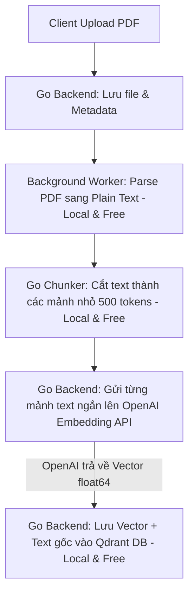
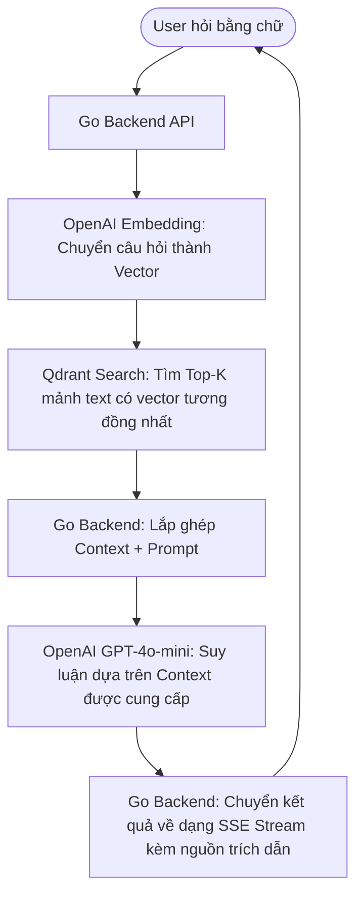

# 🧠 Hỏi Đáp (FAQ) & Tư Duy Cốt Lõi Cho AI Backend Developer

> Tài liệu ghi lại các câu hỏi nền tảng, tư duy hệ thống và cách tối ưu hóa chi phí/hiệu năng khi chuyển đổi từ một Backend Developer truyền thống sang **AI Backend / AI Infra Engineer**.

---

## 📋 Mục lục
1. [Chi phí & Công cụ: Miễn phí vs Trả phí](#1-chi-phí--công-cụ-miễn-phí-vs-trả-phí)
2. [Khái niệm Agent Frameworks (LangChain, AutoGen, Semantic Kernel)](#2-khái-niệm-agent-frameworks-langchain-autogen-semantic-kernel)
3. [Tích hợp Agent Frameworks: Luồng chạy & Chi phí](#3-tích-hợp-agent-frameworks-luồng-chạy--chi-phí)
4. [Luồng xử lý RAG thực tế (Ingestion & Retrieval Flows)](#4-luồng-xử-lý-rag-thực-tế-ingestion--retrieval-flows)
5. [Bộ não AI vs Vai trò thực sự của Backend](#5-bộ-não-ai-vs-vai-trò-thực-sự-của-backend)

---

## 1. Chi phí & Công cụ: Miễn phí vs Trả phí

Để phát triển dự án này tại local, hệ thống sử dụng kết hợp giữa các công cụ mã nguồn mở chạy offline và API trả phí từ đám mây:

### 📊 Bảng phân tích chi phí công cụ

| Công cụ | Vai trò trong hệ thống | Chi phí | Lưu ý kỹ thuật |
| :--- | :--- | :--- | :--- |
| **Golang (Gin)** | API Server / Orchestrator | 🆓 **Miễn phí** | Mã nguồn mở |
| **PostgreSQL** | Lưu Metadata & Chat History | 🆓 **Miễn phí** | Chạy qua Docker |
| **Redis & Asynq** | Hàng đợi công việc (Job Queue) | 🆓 **Miễn phí** | Chạy qua Docker |
| **Qdrant DB** | Cơ sở dữ liệu Vector | 🆓 **Miễn phí** | Chạy local offline qua Docker |
| **pdfcpu** | Trích xuất chữ từ PDF | 🆓 **Miễn phí** | Chạy offline trên máy |
| **OpenAI Embedding API** | Chuyển đổi text ➡️ Vector | 💰 **Trả phí (Siêu rẻ)** | `$0.02` cho mỗi 1 triệu tokens (khoảng 70đ VNĐ cho 1 cuốn sách 300 trang) |
| **OpenAI LLM API** | Suy luận & Trả lời câu hỏi | 💰 **Trả phí (Pay-as-you-go)** | Khoảng `$0.0002 - $0.0007` cho mỗi câu hỏi RAG thực tế (dùng `gpt-4o-mini`) |

> [!TIP]
> **Giải pháp MIỄN PHÍ 100% (Offline hoàn toàn):**
> Nếu không muốn sử dụng OpenAI API, bạn có thể kết nối dự án này với **Ollama** chạy local:
> - Sử dụng model `llama3` hoặc `mistral` cho phần Chat.
> - Sử dụng model `nomic-embed-text` cho phần Embedding.
> *(Yêu cầu phần cứng: Máy Mac có dung lượng RAM tối thiểu 16GB để chạy mượt mà).*

---

## 2. Khái niệm Agent Frameworks (LangChain, AutoGen, Semantic Kernel)

### ❓ Dự án này đã sử dụng các Agent Frameworks chưa?
👉 **CỐ TÌNH CHƯA CÓ.** Dự án được thiết kế chạy bằng **code thuần Golang** (Native Go) không thông qua các thư viện trung gian này.

### 🧠 Tại sao lại chọn giải pháp Code thuần thay vì dùng Framework?
1. **Tránh biến dự án thành "OpenAI API Wrapper":** Các thư viện như LangChain che giấu quá nhiều chi tiết hạ tầng dưới dạng các hàm tiện ích (`VectorStore.add_documents()`). Nếu dùng ngay từ đầu, bạn sẽ không hiểu được bản chất hệ thống.
2. **Làm chủ Backend Engineering:** Việc tự viết Chunker, tự kết nối Qdrant bằng gRPC/HTTP client, tự thiết lập luồng Background Job thông qua Redis giúp bạn tích lũy kinh nghiệm thực tế về xử lý bất đồng bộ, concurrency và độ tin cậy của hệ thống.
3. **Hiệu năng & Khả năng kiểm soát:** Golang hướng tới sự tường minh và hiệu năng cao. Code thuần giúp giảm thiểu overhead, dễ debug lỗi kết nối mạng hoặc lỗi định dạng dữ liệu từ API bên thứ ba.

---

## 3. Tích hợp Agent Frameworks: Luồng chạy & Chi phí

### 🛠️ Khi tích hợp, nó sẽ nằm ở phần nào?
Nếu muốn tích hợp các Agent Framework (ví dụ như bản Go của LangChain là `tmc/langchaingo`), chúng sẽ thay thế các thành phần sau:
* **`internal/service/chat.go`**: Thay thế luồng gọi LLM trực tiếp bằng một **Agent Executor** tự động quản lý bộ nhớ hội thoại (`Memory`) và tự chọn "công cụ" (`Tool Routing`).
* **`internal/service/retrieval.go`**: Thay thế bằng các cấu trúc `Vector Store Retriever` tích hợp sẵn của framework.

### 💰 Tích hợp xong có tốn thêm tiền hay cần Key mới không?
* **Thư viện/Framework:** Bản thân LangChain, AutoGen hay Semantic Kernel là mã nguồn mở và **hoàn toàn miễn phí**.
* **Chi phí API:** Vẫn dùng chung chiếc `OPENAI_API_KEY` của bạn. Tuy nhiên, **chi phí tiền điện toán sẽ tăng lên đáng kể**:
  * Các Agent Framework hoạt động theo cơ chế suy nghĩ từng bước (**Reasoning Loop - ReAct**). Để trả lời 1 câu hỏi phức tạp, Agent có thể phải gọi LLM liên tục 3-4 lần để tự hỏi-đáp trước khi đưa ra kết quả cuối cùng. Do đó số lượng token tiêu thụ sẽ nhiều hơn gấp nhiều lần so với luồng RAG truyền thống.

---

## 4. Luồng xử lý RAG thực tế (Ingestion & Retrieval Flows)

Backend không gửi trực tiếp file PDF/DOCX thô lên OpenAI để nhờ họ đọc hộ. Toàn bộ kiến trúc xử lý của RAG được tối ưu hóa như sau:

### A. Luồng nạp tài liệu (Ingestion Pipeline)

### B. Luồng truy vấn & hỏi đáp (Chat Flow)

---

## 5. Bộ não AI vs Vai trò thực sự của Backend

Trong một hệ thống AI thực tế doanh nghiệp (Enterprise AI), **OpenAI GPT-4o-mini đóng vai trò là "Bộ não"**, còn **Hạ tầng Backend chính là "Hệ thần kinh, Đôi mắt và Người trợ lý thủ thư"**.

### ❌ Tại sao không thể quăng cả file PDF lên giao diện Web ChatGPT để nó tự trả lời?

| Lý do kỹ thuật | Vấn đề khi quăng file trực tiếp | Giải pháp khi dùng RAG Backend |
| :--- | :--- | :--- |
| **Giới hạn & Chi phí** | Càng tải nhiều file, prompt càng dài. Phí gọi API sẽ tăng lũy tiến cực kỳ đắt đỏ. | Chỉ lọc và gửi đúng 3-5 đoạn văn chứa câu trả lời (`top_k`). Tiết kiệm 95% chi phí. |
| **Độ chính xác (Hallucination)** | LLM sẽ bị hiện tượng "Lost in the Middle" (mất tập trung) khi đọc quá nhiều chữ rác. | Chỉ đưa những thông tin cực kỳ cô đọng và liên quan trực tiếp đến câu hỏi. |
| **Tốc độ (Latency)** | Đọc cả quyển sách và suy luận mất hàng phút. | Rút trích thông tin qua Vector DB chỉ mất milliseconds, trả lời mất 1-2 giây. |
| **Phân quyền (Security)** | Mọi user đều có quyền truy cập tất cả các file đã tải lên. | Backend lọc quyền truy cập trước khi tìm kiếm vector (Metadata Filtering). |
| **Trích dẫn nguồn (Citations)** | Rất khó để AI chỉ ra chính xác câu chữ đó nằm ở trang mấy của tài liệu nào. | Chunks được dán nhãn cố định `document_id` và `page_number` giúp xuất trích dẫn tuyệt đối chuẩn xác. |

> [!IMPORTANT]
> **Tư duy của một AI Backend Engineer:**
> *"Hạ tầng Backend quyết định **80% độ chính xác, 90% tốc độ và 95% tính hiệu quả về chi phí** của một hệ thống AI Product trong thực tế. Vị giáo sư LLM chỉ đóng vai trò 20% lập luận ở bước cuối cùng dựa trên bàn làm việc sạch sẽ được dọn sẵn bởi Backend."*
