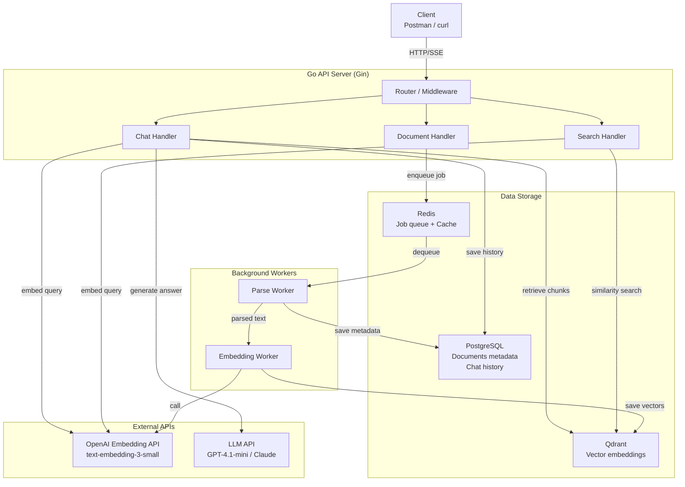
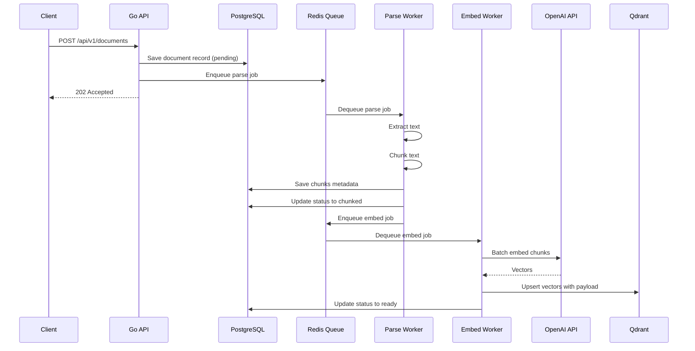
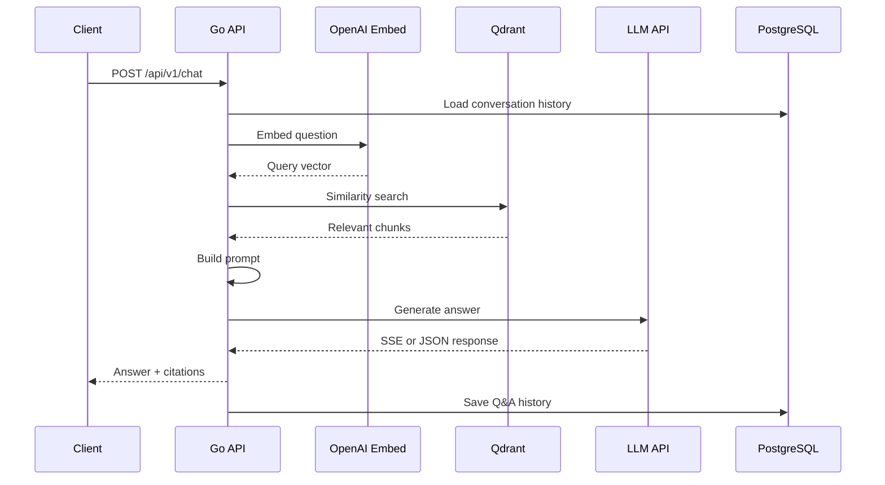

# RAG Chatbot AI Backend - Project Reference

This document holds architecture and implementation reference material. Keep execution tasks in [PROJECT_PLAN.md](../PROJECT_PLAN.md).

## Project Overview

An internal document QA system powered by RAG:

```text
Upload PDF/DOCX -> chunk -> embed -> store in Qdrant -> query -> LLM answer with citations
```

The goal is to understand the backend engineer role in AI products:

- Document ingestion pipeline: parse, chunk, embed, index.
- Vector database operations with Qdrant.
- Retrieval pipeline: query embedding, semantic search, top-k ranking.
- LLM orchestration: prompt construction, streaming, token tracking.
- Citation system grounded in source document metadata.
- Background workers and async job processing.
- Basic observability for AI systems.

## System Architecture



## Request Flow - Document Upload



## Request Flow - Chat Query



## Technology Stack

| Layer | Technology | Why |
|-------|------------|-----|
| HTTP server | Gin | Mature, fast, good middleware ecosystem |
| Background jobs | Asynq | Redis-backed retries and job persistence |
| Vector database | Qdrant | Purpose-built vector search with Go client |
| Embeddings | OpenAI `text-embedding-3-small` | Cost-effective and high quality |
| LLM | OpenAI GPT-4.1-mini | Good enough for MVP RAG answers |
| PDF parsing | `pdfcpu` or `unipdf` | Go-compatible PDF text extraction |
| DOCX parsing | `unioffice` | Deferred until after MVP |
| RDBMS | PostgreSQL | Metadata, document state, chat history |
| Queue/cache | Redis | Asynq backend and optional query cache |
| SQL layer | sqlc | Type-safe SQL with explicit queries |
| Migration | golang-migrate | Simple file-based migrations |
| Config | Viper | Env and config-file support |
| Logging | zerolog | Structured JSON logging |
| Local infra | Docker Compose | Easy local Postgres, Redis, Qdrant |

## Data Model

### `documents`

```sql
CREATE TABLE documents (
    id          UUID PRIMARY KEY DEFAULT gen_random_uuid(),
    filename    VARCHAR(500) NOT NULL,
    file_size   BIGINT NOT NULL,
    file_type   VARCHAR(20) NOT NULL,
    status      VARCHAR(20) NOT NULL DEFAULT 'pending',
    chunk_count INT DEFAULT 0,
    error_msg   TEXT,
    created_at  TIMESTAMPTZ NOT NULL DEFAULT NOW(),
    updated_at  TIMESTAMPTZ NOT NULL DEFAULT NOW()
);

CREATE INDEX idx_documents_status ON documents(status);
```

Status flow:

```text
pending -> parsing -> chunked -> embedding -> ready -> failed
```

### `chunks`

```sql
CREATE TABLE chunks (
    id            UUID PRIMARY KEY DEFAULT gen_random_uuid(),
    document_id   UUID NOT NULL REFERENCES documents(id) ON DELETE CASCADE,
    chunk_index   INT NOT NULL,
    content       TEXT NOT NULL,
    page_number   INT,
    token_count   INT NOT NULL,
    qdrant_id     UUID,
    created_at    TIMESTAMPTZ NOT NULL DEFAULT NOW()
);

CREATE INDEX idx_chunks_document_id ON chunks(document_id);
```

### `chat_sessions`

```sql
CREATE TABLE chat_sessions (
    id          UUID PRIMARY KEY DEFAULT gen_random_uuid(),
    title       VARCHAR(500),
    created_at  TIMESTAMPTZ NOT NULL DEFAULT NOW(),
    updated_at  TIMESTAMPTZ NOT NULL DEFAULT NOW()
);
```

### `chat_messages`

```sql
CREATE TABLE chat_messages (
    id              UUID PRIMARY KEY DEFAULT gen_random_uuid(),
    session_id      UUID NOT NULL REFERENCES chat_sessions(id) ON DELETE CASCADE,
    role            VARCHAR(20) NOT NULL,
    content         TEXT NOT NULL,
    citations       JSONB,
    token_usage     JSONB,
    latency_ms      INT,
    created_at      TIMESTAMPTZ NOT NULL DEFAULT NOW()
);

CREATE INDEX idx_chat_messages_session_id ON chat_messages(session_id);
```

## Qdrant Collection

```json
{
  "collection_name": "documents",
  "vectors": {
    "size": 1536,
    "distance": "Cosine"
  },
  "payload_schema": {
    "document_id": "keyword",
    "filename": "keyword",
    "page_number": "integer",
    "chunk_index": "integer",
    "text": "text"
  }
}
```

Example point:

```json
{
  "id": "uuid",
  "vector": [0.012, -0.034],
  "payload": {
    "document_id": "abc-123",
    "filename": "refund-policy.pdf",
    "page_number": 12,
    "chunk_index": 4,
    "text": "The refund policy for delivery orders states that..."
  }
}
```

## API Contracts

Base URL: `/api/v1`

### Upload Document

```http
POST /api/v1/documents
Content-Type: multipart/form-data

file: <binary>
```

Response:

```json
{
  "id": "550e8400-e29b-41d4-a716-446655440000",
  "filename": "refund-policy.pdf",
  "file_size": 245760,
  "file_type": "pdf",
  "status": "pending",
  "created_at": "2026-05-19T10:00:00Z"
}
```

### List Documents

```http
GET /api/v1/documents?status=ready&page=1&limit=20
```

### Get Document Status

```http
GET /api/v1/documents/:id
```

### Delete Document

```http
DELETE /api/v1/documents/:id
```

Delete must remove PostgreSQL chunks and Qdrant vectors.

### Semantic Search

```http
POST /api/v1/search
Content-Type: application/json

{
  "query": "Quy trinh refund cho don delivery la gi?",
  "top_k": 5,
  "score_threshold": 0.7
}
```

Response:

```json
{
  "query": "Quy trinh refund cho don delivery la gi?",
  "results": [
    {
      "chunk_id": "uuid",
      "document_id": "uuid",
      "filename": "refund-policy.pdf",
      "page_number": 12,
      "chunk_index": 4,
      "text": "Quy trinh refund cho don delivery...",
      "score": 0.89
    }
  ],
  "latency_ms": 120
}
```

### Chat

```http
POST /api/v1/chat
Content-Type: application/json

{
  "question": "Quy trinh refund cho don delivery la gi?",
  "session_id": "optional-uuid",
  "top_k": 5,
  "stream": true
}
```

Non-streaming response:

```json
{
  "answer": "Theo tai lieu refund-policy.pdf, quy trinh refund...",
  "citations": [
    {
      "document_id": "uuid",
      "filename": "refund-policy.pdf",
      "page_number": 12,
      "text_snippet": "Buoc 1: Xac nhan don hang..."
    }
  ],
  "session_id": "uuid",
  "token_usage": {
    "prompt_tokens": 850,
    "completion_tokens": 230
  },
  "latency_ms": 2300
}
```

Streaming response:

```text
Content-Type: text/event-stream

data: {"type":"token","content":"Theo"}
data: {"type":"token","content":" tai lieu"}
data: {"type":"citations","citations":[...]}
data: {"type":"done","token_usage":{...},"latency_ms":2300}
```

### Chat Sessions

```http
GET /api/v1/chat/sessions?page=1&limit=20
GET /api/v1/chat/sessions/:id/messages
```

### Health

```http
GET /api/v1/health
```

```json
{
  "status": "ok",
  "services": {
    "postgres": "connected",
    "redis": "connected",
    "qdrant": "connected"
  }
}
```

## Suggested Go Project Structure

```text
rag-chatbot/
├── cmd/
│   ├── api/
│   └── worker/
├── internal/
│   ├── chunker/
│   ├── config/
│   ├── handler/
│   ├── middleware/
│   ├── model/
│   ├── parser/
│   ├── prompt/
│   ├── repository/
│   ├── service/
│   └── worker/
├── db/
│   └── migrations/
├── queries/
├── docker-compose.yml
├── Dockerfile
├── Makefile
├── go.mod
├── sqlc.yaml
├── .env.example
└── README.md
```

## Key Design Decisions

### Asynq over direct goroutines

Document ingestion is multi-step and should survive API crashes. Asynq gives persistent Redis-backed queues, retries, scheduling, and job visibility.

### sqlc over GORM

For this learning project, explicit SQL is more educational and predictable. `sqlc` still gives type-safe generated code.

### Separate API and worker binaries

`cmd/api` and `cmd/worker` keep responsibilities clear and make it easy to scale or debug each process independently.

### Chunking defaults

```text
chunk_size = 500 tokens
overlap = 100 tokens
```

This is large enough to retain context and small enough for precise retrieval. Each chunk should carry `document_id`, `page_number`, and `chunk_index` for citations.

### Prompting approach

```text
You are a helpful assistant that answers questions based ONLY on the provided context.
If the answer cannot be found in the context, say you do not have enough information.
Always cite sources using [Source: filename, Page: X].

Context:
[1] chunk text - Source: refund-policy.pdf, Page 12

Conversation History:
...

Current Question:
...
```

## Learning Objectives

| Area | What You Learn |
|------|----------------|
| Ingestion pipeline | How to process documents through parse, chunk, embed, and index |
| Vector databases | Similarity search, payload filtering, and score thresholds |
| Embedding models | How text becomes vectors and why dimensions matter |
| LLM orchestration | Prompt design, token management, streaming, and costs |
| RAG pattern | Retrieval-augmented generation architecture |
| Citations | Grounding answers in source metadata |
| Worker architecture | Async processing, retries, failure states |
| AI observability | Latency, token usage, retrieval quality, and queue depth |
