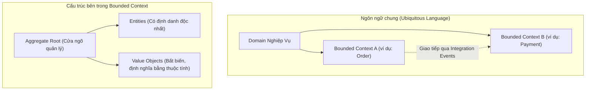

# SỔ TAY KIẾN TRÚC PHẦN MỀM & SYSTEM DESIGN
## Tài liệu tổng hợp kiến thức chuyên sâu dành cho Senior Backend Engineer

Tài liệu này hệ thống hóa toàn bộ các kiến thức cốt lõi về thiết kế hệ thống phân tán, cơ chế xác thực nâng cao, an toàn thông tin, tối ưu hóa cơ sở dữ liệu và hạ tầng điện toán đám mây. Đồng thời tích hợp kế hoạch hành động triển khai thực tế dịch vụ chữ ký số VNPT SmartCA.

---

# PHẦN 1: KIẾN TRÚC HỆ THỐNG VÀ PHÂN TÁN (SYSTEM ARCHITECTURE)

## 1. Monolith vs. Microservices
Việc dịch chuyển từ kiến trúc đơn khối (Monolith) sang kiến trúc vi dịch vụ (Microservices) là một quyết định đánh đổi chiến lược (trade-off) về mặt kỹ thuật và tổ chức.

*   **Kiến trúc Monolith (Đơn khối):**
    *   *Ưu điểm:* Đơn giản trong phát triển ban đầu, kiểm thử toàn diện dễ dàng, triển khai nhanh chóng (single deployable unit), độ trễ gọi hàm (in-memory call) bằng 0.
    *   *Nhược điểm:* Khó mở rộng quy mô khi mã nguồn quá lớn, nghẽn cổ chai khi phân bổ tài nguyên (không thể scale riêng lẻ cấu phần nặng tính toán), rủi ro single point of failure (một module lỗi kéo sập toàn bộ hệ thống), cản trở đổi mới công nghệ.
*   **Kiến trúc Microservices (Vi dịch vụ):**
    *   *Ưu điểm:* Khả năng mở rộng độc lập (scale các dịch vụ cụ thể), cô lập lỗi (fault isolation), phân tách trách nhiệm rõ ràng cho các nhóm phát triển (tối ưu hóa quy mô tổ chức), linh hoạt công nghệ.
    *   *Nhược điểm:* Độ trễ mạng (network latency) tăng do giao tiếp qua RPC/REST, độ phức tạp vận hành (logging, tracing, monitoring) tăng vọt, quản lý dữ liệu phân tán phức tạp, giao dịch phân tán khó duy trì tính toàn vẹn dữ liệu.
*   **Tiêu chí dịch chuyển:** Chỉ dịch chuyển khi quy mô tổ chức vượt quá khả năng cộng tác trên một repo đơn lẻ, hoặc khi các phần của ứng dụng có đặc tính tải trọng và yêu cầu về tài nguyên hoàn toàn khác biệt.

---

## 2. Domain-Driven Design (DDD)
DDD là phương pháp luận thiết kế phần mềm tập trung vào việc mô hình hóa các nghiệp vụ phức tạp của thế giới thực vào cấu trúc mã nguồn.



*   **Bounded Context (Bối cảnh giới hạn):** Xác định ranh giới rõ ràng nơi một mô hình miền cụ thể được áp dụng thống nhất. Một từ khóa (ví dụ: `Product`) có thể có ý nghĩa và cấu trúc dữ liệu hoàn toàn khác biệt trong Context "Bán hàng" so với Context "Kho vận".
*   **Ubiquitous Language (Ngôn ngữ chung):** Bộ thuật ngữ thống nhất được chia sẻ giữa lập trình viên và chuyên gia nghiệp vụ (Domain Experts) nhằm xóa bỏ khoảng cách giao tiếp và dịch thuật sai lệch.
*   **Aggregate Root (Gốc tập hợp):** Một thực thể đóng vai trò làm cửa ngõ duy nhất để tương tác và thay đổi trạng thái của một nhóm các đối tượng liên quan (Entities và Value Objects), đảm bảo các quy tắc ràng buộc toàn vẹn dữ liệu (invariants) luôn được thực thi nghiêm ngặt.
*   **Entities vs. Value Objects:**
    *   *Entities:* Có định danh độc nhất không đổi theo thời gian (ví dụ: `User ID`, `Order ID`).
    *   *Value Objects:* Không có định danh riêng, được định nghĩa hoàn toàn bởi các giá trị thuộc tính của nó và có tính chất bất biến (immutable) (ví dụ: `Money` gồm số lượng và đơn vị tệ, `Address`).

---

## 3. Saga Pattern & Quản lý Giao dịch Phân tán
Trong kiến trúc microservices với mô hình cơ sở dữ liệu riêng biệt cho mỗi dịch vụ (Database per Service), giao dịch ACID truyền thống không còn khả thi. Saga Pattern là giải pháp quản lý giao dịch phân tán thông qua một chuỗi các giao dịch cục bộ độc lập.

Có hai mô hình triển khai chính:

### Mô hình Choreography (Định hướng sự kiện tự phát)
Các dịch vụ tự phản ứng và xuất bản sự kiện (Publish/Subscribe) mà không cần bộ điều phối trung tâm.
*   *Ưu điểm:* Thiết kế đơn giản, phân tán hoàn toàn, không có single point of failure ở tầng điều phối.
*   *Nhược điểm:* Khó theo dõi luồng nghiệp vụ khi số lượng dịch vụ tăng lên, nguy cơ tạo vòng lặp sự kiện tuần hoàn (cyclic dependency).

### Mô hình Orchestration (Điều phối viên trung tâm)
Một dịch vụ trung tâm đóng vai trò điều phối (`Orchestrator`) chịu trách nhiệm ra quyết định dịch vụ nào sẽ thực thi bước tiếp theo và xử lý các lỗi phát sinh.
*   *Ưu điểm:* Kiểm soát luồng nghiệp vụ tập trung, dễ quản lý trạng thái giao dịch phức tạp, giảm phụ thuộc vòng chéo giữa các dịch vụ.
*   *Nhược điểm:* Bộ điều phối trung tâm có nguy cơ trở thành điểm nghẽn hiệu năng hoặc điểm lỗi duy nhất nếu không được thiết kế có tính sẵn sàng cao.
*   *Giao dịch bù (Compensating Transactions):* Khi một bước trong Saga thất bại, hệ thống phải kích hoạt chuỗi giao dịch bù theo thứ tự ngược lại để khôi phục (rollback) trạng thái dữ liệu về mức nhất quán trước đó.

---

## 4. CQRS (Command Query Responsibility Segregation)
CQRS là kiến trúc phân tách hoàn toàn luồng xử lý cập nhật dữ liệu (Command - Ghi) và luồng xử lý đọc dữ liệu (Query - Đọc).

```
                      ┌───────────────┐
                      │   API Client  │
                      └───────┬───────┘
           ┌──────────────────┴──────────────────┐
     [Luồng Ghi]                           [Luồng Đọc]
           ▼                                     ▼
  ┌─────────────────┐                   ┌─────────────────┐
  │ Write Service   │                   │ Read Service    │
  └────────┬────────┘                   └────────┬────────┘
           ▼                                     ▼
  ┌─────────────────┐                   ┌─────────────────┐
  │ Write Database  │                   │ Read Database   │
  │  (Normalized)   │                   │ (Denormalized)  │
  └────────┬────────┘                   └────────▲────────┘
           │                                     │
           └────► [Event Bus (Kafka/RabbitMQ)] ──┘
                     (Đồng bộ bất đồng bộ)
```

*   **Command Model (Write DB):** Tối ưu hóa cho các thao tác ghi dữ liệu, chuẩn hóa cao (normalized) để đảm bảo tính toàn vẹn nghiệp vụ, xử lý validation và nghiệp vụ phức tạp.
*   **Query Model (Read DB):** Tối ưu hóa cực cao cho các thao tác đọc/tìm kiếm, phi chuẩn hóa (denormalized), lưu sẵn cấu trúc dữ liệu mà giao diện (UI) yêu cầu.
*   **Cơ chế đồng bộ (Eventual Consistency):** Khi luồng Write cập nhật dữ liệu thành công, một sự kiện (Integration Event) được phát ra qua Event Bus (như Kafka hoặc RabbitMQ) để luồng Read tiêu thụ và cập nhật lại Read DB một cách bất đồng bộ. Nhược điểm là có một khoảng trễ nhỏ về tính nhất quán dữ liệu.

---

## 5. Event-Driven Architecture (EDA) & Service Communication
Kiến trúc hướng sự kiện (EDA) giúp giảm thiểu sự phụ thuộc trực tiếp (decoupling) giữa các dịch vụ và cải thiện khả năng chịu lỗi của hệ thống.

*   **Loose Coupling:** Dịch vụ phát sự kiện không cần biết ai tiêu thụ sự kiện đó hoặc khi nào họ tiêu thụ. Hệ thống hoạt động bất đồng bộ giúp tránh tình trạng nghẽn dây chuyền (cascading failures).
*   **gRPC vs. REST/HTTP:** Trong giao tiếp nội bộ giữa các microservices (East-West traffic):
    *   `gRPC` vượt trội nhờ sử dụng giao thức `HTTP/2` cho phép dồn kênh (multiplexing) trên một kết nối duy nhất, định dạng nhị phân `Protocol Buffers` cực nhẹ giúp giảm thiểu I/O serialization, hỗ trợ truyền luồng dữ liệu hai chiều (bidirectional streaming).
    *   `REST` chỉ nên dùng cho các giao tiếp ngoại vi hướng tới client (North-South traffic).

---

## 6. Lựa chọn Công nghệ: Temporal vs. RabbitMQ trong Golang Microservices
Việc chọn lựa công cụ truyền tin và quản lý quy trình công việc là tối quan trọng trong Golang.

| Tiêu chí | RabbitMQ (Message Broker) | Temporal (Workflow Orchestration) |
| :--- | :--- | :--- |
| **Bản chất** | Hệ thống chuyển phát tin nhắn bất đồng bộ theo cơ chế Pub/Sub. | Động cơ điều phối luồng công việc phân tán có trạng thái (Stateful). |
| **Khả năng lưu trạng thái** | Không trạng thái (Stateless) - Tin nhắn được tiêu thụ xong là biến mất. | Lưu trạng thái cực kỳ chặt chẽ (Stateful) trên từng bước của luồng. |
| **Xử lý giao dịch dài hạn** | Khó khăn, đòi hỏi lập trình viên tự quản lý cơ chế retry, state machine thủ công. | Tự động quản lý retry nâng cao, timeout, và tự động gọi Transaction bù. |
| **Độ phức tạp tích hợp** | Thấp, dễ cài đặt và kết nối. | Cao, yêu cầu cài đặt cụ thể dịch vụ Temporal Server để quản lý trạng thái. |
| **Trường hợp sử dụng** | - Gửi email thông báo bất đồng bộ.<br>- Phân phối các tác vụ tính toán độc lập.<br>- Decouple nhanh giữa hai service. | - Quy trình xử lý đơn hàng F&B nhiều bước (Order -> Payment -> Kitchen -> Delivery).<br>- Giao dịch ngân hàng cần retry thông minh trong nhiều ngày.<br>- Quản lý đăng ký tài khoản dài hạn. |

---

## 7. Kiến trúc Apache Kafka & Thiết kế Consumer Group chuyên sâu
Apache Kafka là một nền tảng truyền phát sự kiện phân tán (Distributed Event Streaming) có thông lượng cực cao, khả năng chịu lỗi xuất sắc, và khả năng mở rộng ngang hoàn hảo.

### Cơ chế hoạt động của Consumer Groups & Rebalancing
*   **Consumer Group (Nhóm tiêu thụ):** Tập hợp các Consumer cùng hợp tác tiêu thụ dữ liệu từ một Topic. Mỗi Partition chỉ được gán cho duy nhất một Consumer trong Group tại một thời điểm để đảm bảo tính tuần tự của thông điệp (`Message Ordering`) trên từng phân mảnh.
*   **Phân bổ Partition:** Nếu số lượng Consumer nhiều hơn số Partition, một số Consumer sẽ rơi vào trạng thái rảnh rỗi (idle). Do đó, số lượng Partition đóng vai trò làm giới hạn trần cho khả năng mở rộng ngang (horizontal scalability) của luồng đọc dữ liệu.
*   **Rebalance (Tái phân bổ):** Khi một Consumer tham gia hoặc rời nhóm (hoặc Broker gặp sự cố), Kafka kích hoạt cơ chế `Rebalance` để phân bổ lại các Partition. Quá trình này có thể gây gián đoạn ngắn (stop-the-world) và làm giảm hiệu năng hệ thống. Cần tối ưu hóa các thông số như `max.poll.interval.ms` và `session.timeout.ms` để giảm thiểu các Rebalance không mong muốn.

### Quản lý Vị trí đọc (Offset Management)
*   **Commit Offset:** Vị trí đọc của Consumer được commit về topic nội bộ `__consumer_offsets`.
*   **At-least-once (Ít nhất một lần):** Tiêu thụ tin nhắn -> Xử lý nghiệp vụ -> Commit offset. Rủi ro: Xử lý thành công nhưng crash trước khi commit offset -> Consumer khởi động lại sẽ tiêu thụ lại tin nhắn đó. *Giải pháp:* Phải thiết kế luồng xử lý trùng lặp (`Idempotency`) ở phía backend tiêu thụ.
*   **At-most-once (Tối đa một lần):** Tiêu thụ tin nhắn -> Commit offset ngay lập tức -> Xử lý nghiệp vụ. Rủi ro: Xử lý thất bại -> Mất dữ liệu vĩnh viễn.
*   **Exactly-once (Chính xác một lần):** Sử dụng cơ chế Kafka Transactions (kết hợp idempotent producer) để đảm bảo toàn vẹn dữ liệu trong cả chuỗi Read-Process-Write.

### Tại sao Kafka có hiệu năng vượt trội? (High-Throughput Design)
1.  **Sequential I/O (Ghi tuần tự):** Ghi tuần tự vào cuối file log trên đĩa cứng, nhanh hơn hàng ngàn lần so với truy cập đĩa ngẫu nhiên (Random I/O), biến ổ cứng thành một phương tiện lưu trữ tốc độ cao.
2.  **Zero-Copy Technology:** Sử dụng lệnh hệ thống `sendfile` (trên Linux) để truyền dữ liệu trực tiếp từ OS Page Cache sang Network Socket mà không cần copy dữ liệu qua không gian người dùng (User-space memory), giảm thiểu tối đa CPU usage.
3.  **Batching & Compression (Gom cụm & Nén):** Gom cụm nhiều tin nhắn thành một lô (batch) để gửi và nén dữ liệu giúp tiết kiệm tối đa băng thông mạng và I/O đĩa.

---

# PHẦN 2: CƠ SỞ DỮ LIỆU & BỘ NHỚ ĐỆM (DATABASE & CACHING)

## 1. Phân trang tối ưu: Cursor-based vs. Offset-based Pagination
Lựa chọn phương thức phân trang ảnh hưởng trực tiếp đến tài nguyên RAM và I/O của cơ sở dữ liệu khi hệ thống mở rộng.

```
Mô hình quét dữ liệu của Offset-based Pagination (Hạn chế):
PAGE 1 (Limit 10):      [1..10]
PAGE 1000 (Offset 9990): [======Quét và bỏ qua 9990 dòng đầu======] -> [9991..10000] (Rất chậm)

Mô hình quét dữ liệu của Cursor-based Pagination (Tối ưu):
PAGE 1:                 [1..10]
PAGE 2:                 Lọc theo WHERE _id < Last_ID_Page_1 LIMIT 10 (Quét trực tiếp, không skip)
```

*   **Offset-based Pagination (Sử dụng `skip()` và `limit()` / `OFFSET` và `LIMIT`):**
    *   *Cơ chế:* Hệ thống phải quét qua tất cả các dòng dữ liệu trước đó (offset) rồi mới lấy ra số lượng cần thiết (limit) và vứt bỏ phần dữ liệu đã quét trước đó.
    *   *Hệ quả:* Khi offset lớn (ví dụ: trang thứ 10000), hiệu năng sụt giảm nghiêm trọng, tiêu tốn CPU/RAM để lưu trữ dữ liệu rác tạm thời. Ngoài ra, dễ gặp lỗi trùng lặp/bỏ sót dữ liệu nếu có bản ghi mới được chèn vào trong quá trình phân trang.
*   **Cursor-based Pagination (Phân trang con trỏ):**
    *   *Cơ chế:* Dùng giá trị thuộc tính độc nhất mang tính tuần tự (ví dụ: `_id` hoặc `createdAt` kết hợp `_id`) của bản ghi cuối cùng của trang trước làm mốc lọc dữ liệu cho trang tiếp theo (ví dụ: `WHERE _id < last_seen_id LIMIT 10`).
    *   *Ưu điểm:* Hiệu năng ổn định thời gian thực (O(1) hoặc O(log N) nếu đánh index tốt), loại bỏ hoàn toàn việc quét dữ liệu thừa, không bị lỗi lệch trang khi dữ liệu biến động liên tục.

---

## 2. Chiến lược Tối ưu hóa Database chuyên sâu
*   **Replication (Sao chép dữ liệu):** Thiết lập mô hình Primary-Secondary. Mọi thao tác ghi thực hiện trên node Primary, dữ liệu được sao chép (đồng bộ/bất đồng bộ) sang các node Secondary. Client thực hiện đọc dữ liệu từ Secondary để phân tải cho Primary. Lưu ý rủi ro `Replication Lag` có thể dẫn đến việc đọc dữ liệu cũ chưa kịp đồng bộ.
*   **Sharding (Phân mảnh ngang):** Chia tách bảng dữ liệu lớn ra nhiều máy chủ vật lý dựa trên một `Shard Key`. Cần cân nhắc kỹ thiết kế Shard Key để tránh xuất hiện phân mảnh nóng (`Hot Shard`) do khóa tăng dần tuần tự (Monotonic Shard Key) hoặc phân bổ dữ liệu không đồng đều.
*   **Indexing (Đánh chỉ mục):** Áp dụng quy tắc tiền tố (Prefix Rule) khi thiết kế Compound Index. Tránh lạm dụng chỉ mục (`Over-indexing`) trên các hệ thống có tần suất ghi cao (Write-heavy), vì mỗi thao tác ghi sẽ buộc cơ sở dữ liệu cập nhật lại toàn bộ cây chỉ mục liên quan, gây nghẽn I/O đĩa cứng.
*   **Transactions:** Hiểu rõ các cấp độ cô lập giao dịch (Read Uncommitted, Read Committed, Repeatable Read, Serializable). Trong hệ thống phân tán, ưu tiên thiết kế các idempotent transaction để đối phó với sự cố mạng.

---

## 3. MongoDB Schema Validation
Mặc dù là cơ sở dữ liệu Schema-less, MongoDB vẫn cung cấp tính năng **Schema Validation** thông qua toán tử `$jsonSchema` ở cấp độ database. Điều này giúp ngăn chặn tình trạng ô nhiễm dữ liệu (data pollution) ngay tại tầng lưu trữ thay vì chỉ phụ thuộc vào validation ở tầng ứng dụng.

*   *Cách thức hoạt động:* Thiết lập các quy tắc bắt buộc về kiểu dữ liệu (data type), các trường bắt buộc xuất hiện (required fields), định dạng dữ liệu (regex) cho từng Collection.
*   *Mẫu thiết kế khuyên dùng:* Kết hợp `Schema Validation` chặt chẽ cho các trường nghiệp vụ cốt lõi cùng với việc duy trì trường `schema_version` trong tài liệu để thực hiện cuốn chiếu cấu trúc dữ liệu (`Rolling Migration`) trơn tru.

---

## 4. Redis: Bản chất Single-Threaded và Cache-aside Pattern
*   **Tại sao Redis đơn luồng (Single-Threaded) nhưng lại có hiệu năng siêu việt?**
    1.  *Lưu trữ bộ nhớ RAM:* Toàn bộ thao tác dữ liệu được thực hiện trực tiếp trên RAM, triệt tiêu hoàn toàn độ trễ I/O đĩa cứng.
    2.  *Cơ chế Non-blocking I/O Multiplexing:* Sử dụng bộ chọn sự kiện (như `epoll` trên Linux) để quản lý hàng vạn kết nối đồng thời trên một luồng duy nhất mà không bị khóa (non-blocking).
    3.  *Không tốn chi phí đổi ngữ cảnh (Context Switching):* Việc chạy đơn luồng giúp Redis loại bỏ hoàn toàn chi phí chuyển đổi giữa các CPU thread và tránh được tranh chấp khóa bảo vệ tài nguyên (`Lock Contention`).
*   **Thiết kế Cache-aside Pattern (Mẫu đệm bên cạnh):**

```
[LUỒNG ĐỌC (READ FLOW)]
API Request ──► Kiểm tra Redis Cache ──(Có Data)──► Trả về kết quả
                     │
                 (Hụt Cache - Cache Miss)
                     ▼
             Truy vấn DB gốc ──► Ghi kết quả vào Redis Cache ──► Trả về kết quả

[LUỒNG GHI (WRITE FLOW)]
API Update ──► Ghi trực tiếp vào DB gốc ──► Xóa (Evict) Key tương ứng trong Redis Cache
```

*Lưu ý:* Việc xóa key cache thay vì cập nhật trực tiếp vào cache giúp ngăn chặn rủi ro bất nhất quán dữ liệu do các phiên ghi đồng thời đè chéo lên nhau.

---

# PHẦN 3: XÁC THỰC, PHÂN QUYỀN VÀ QUẢN LÝ PHIÊN (AUTH & SECURITY)

## 1. Cơ chế Access Token vs. Refresh Token chuyên sâu
Hệ thống xác thực token hiện đại phải cân bằng giữa trải nghiệm người dùng và mức độ an toàn thông tin.

```
                           [LUỒNG XÁC THỰC CHUẨN]
                           
      ┌──────────┐            Gửi Username/Password          ┌─────────────┐
      │          ├──────────────────────────────────────────►│             │
      │  Client  │◄──────────────────────────────────────────┤ Auth Server │
      │          │     Trả về: Access Token (Sống 15 phút)   │             │
      └────┬─────┘             Refresh Token (Sống 7 ngày)   └─────────────┘
           │
           │  Mỗi Request: Gửi kèm Access Token
           ▼
      ┌──────────┐  Hết hạn (401 Unauthorized)
      │ Resource │────────────────────────┐
      │  Server  │                        │
      └──────────┘                        ▼
      ┌──────────┐     Gửi Refresh Token để đổi mới          ┌─────────────┐
      │  Client  ├──────────────────────────────────────────►│ Auth Server │
      │          │◄──────────────────────────────────────────┤             │
      └──────────┘    Cấp Access Token & Refresh Token MỚI   └─────────────┘
                            (Refresh Token Rotation)
```

*   **Access Token (Thường là JWT):** Thời gian sống rất ngắn (5 - 15 phút). Dùng để xác thực trực tiếp tại các API Gateway hoặc Resource Services mà không cần truy vấn Database.
*   **Refresh Token:** Thời gian sống dài (ngày/tuần). Lưu trữ an toàn ở phía client (ví dụ: HTTP-Only cookie) để gửi lên Auth Server đổi lấy cặp Access/Refresh Token mới khi Access Token cũ hết hạn.
*   **Refresh Token Rotation (RTR):** Mỗi khi sử dụng Refresh Token để lấy Access Token mới, hệ thống sẽ phát hành một Refresh Token mới và vô hiệu hóa ngay Refresh Token cũ.
*   **Reuse Detection (Phát hiện dùng lại):** Nếu một Refresh Token cũ (đã từng được sử dụng) được gửi lên Auth Server, hệ thống hiểu rằng đang có cuộc tấn công giả mạo (token bị leak). *Hành động lập tức:* Auth Server lập tức vô hiệu hóa toàn bộ các Refresh Token thuộc dòng họ session đó, buộc người dùng thật phải đăng nhập lại từ đầu để bảo mật.

---

## 2. Stateful vs. Stateless Authentication
*   **Stateless Auth (JWT thuần túy):**
    *   *Cơ chế:* Mọi thông tin định danh và phân quyền được mã hóa thẳng vào JWT payload và ký bằng khóa bí mật. Server chỉ cần giải mã chữ ký để xác thực mà không cần tra cứu dữ liệu.
    *   *Hạn chế lớn:* Không thể thu hồi quyền (revoke token) trước thời hạn hết hạn tự nhiên của JWT.
*   **Stateful Auth (Session-based truyền thống):**
    *   *Cơ chế:* Lưu mã định danh phiên (Session ID) trong DB hoặc Redis. Mỗi request gửi lên bắt buộc phải truy vấn kho lưu trữ để kiểm tra tính hợp lệ của session.
    *   *Ưu điểm:* Dễ dàng thu hồi phiên ngay lập tức (logout, evict user).
*   **Kiến trúc Hybrid (Giải pháp tối ưu cho Production):** Sử dụng JWT để tận dụng lợi thế stateless của vi dịch vụ, nhưng duy trì một danh sách đen (`Blacklist`) hoặc danh sách phiên hợp lệ siêu nhẹ lưu trong Redis. Khi cần thu hồi quyền lập tức (logout, đổi mật khẩu), Server ghi mã định danh JWT (`jti`) vào Redis Blacklist với thời gian hết hạn bằng đúng TTL còn lại của JWT đó.

---

## 3. Quản lý Phiên làm việc Đa Thiết bị (Multi-Device Sessions)
Để xây dựng tính năng quản lý session chuyên nghiệp như Facebook hay Zalo:
1.  *Cấu trúc lưu trữ:* Mỗi user có thể sở hữu nhiều phiên đăng nhập đang hoạt động. Cần lưu danh sách session trong cơ sở dữ liệu kèm theo các siêu dữ liệu (metadata) bao gồm:
    *   `session_id` (Độc nhất)
    *   `user_agent` (Trình duyệt, Hệ điều hành)
    *   `ip_address` (Địa điểm gần đúng)
    *   `last_active_at` (Thời gian hoạt động cuối cùng)
    *   `token_version` (Phiên bản token)
2.  *Token Versioning:* Trong JWT payload luôn nhúng trường `token_version`. Khi người dùng thực hiện đổi mật khẩu hoặc chọn "Đăng xuất khỏi toàn bộ thiết bị", hệ thống tăng giá trị `token_version` của người dùng trong Database lên 1. Mọi JWT cũ mang version thấp hơn sẽ lập tức bị Gateway từ chối trong quá trình kiểm tra.

---

## 4. OAuth 2.0 và OpenID Connect (OIDC)
Hiểu rõ bản chất để tích hợp an toàn các dịch vụ đăng nhập xã hội (Login with Google/Facebook) hoặc hệ thống xác thực tập trung (SSO).

*   **OAuth 2.0 (Ủy quyền - Authorization):**
    *   *Mục tiêu:* Cho phép ứng dụng bên thứ ba truy cập một phần tài nguyên của người dùng mà không cần biết mật khẩu của họ.
    *   *Concepts:*
        *   `Resource Owner` (Người dùng)
        *   `Client` (Ứng dụng cần quyền)
        *   `Authorization Server` (Nơi cấp quyền, ví dụ: Google Identity)
        *   `Resource Server` (Nơi chứa dữ liệu tài nguyên)
        *   `Scope` (Phạm vi quyền hạn yêu cầu, ví dụ: `read:profile`)
*   **OpenID Connect (Xác thực - Authentication):**
    *   *Mục tiêu:* Xây dựng một tầng xác thực danh tính người dùng phía trên nền tảng OAuth 2.0.
    *   *Sản phẩm cốt lõi:* Trả thêm một **ID Token** (định dạng JWT chứa thông tin định danh cá nhân của người dùng như email, họ tên) bên cạnh `Access Token` của OAuth 2.0.

---

## 5. Xác thực Đa Yếu Tố (MFA) & Passkey thế hệ mới
*   **SMS OTP:** Tiện lợi nhưng có độ bảo mật thấp nhất, dễ bị tấn công qua các kỹ thuật như SIM Swapping, đánh chặn sóng viễn thông. Chi phí vận hành cao.
*   **TOTP (Time-Based One-Time Password):** Sử dụng các ứng dụng như Google Authenticator. Dựa trên thuật toán mã hóa khóa đối xứng chia sẻ trước và dấu mốc thời gian thời gian thực để sinh mã OTP sau mỗi 30 giây. Rất an toàn và không tốn chi phí gửi tin nhắn.
*   **Passkey (FIDO2 / WebAuthn):**
    *   *Cơ chế:* Thay thế hoàn toàn mật khẩu truyền thống bằng mật mã học bất đối xứng. Thiết bị của người dùng sinh ra một cặp khóa Public/Private. Khóa Private được lưu trữ an toàn trong chip bảo mật của thiết bị (được bảo vệ bằng vân tay/khuôn mặt), khóa Public được gửi lên Server của bạn.
    *   *Ưu việt:* Chống tấn công lừa đảo (`Anti-phishing`) tuyệt đối vì trình duyệt chỉ cho phép gửi chữ ký xác thực đúng với tên miền đã đăng ký cặp khóa.
*   **Cơ chế Phục hồi tài khoản (Fallback):** Luôn chuẩn bị các phương án dự phòng an toàn như mã khôi phục sử dụng một lần (Backup Codes), hoặc xác minh qua Email tin cậy khi người dùng làm mất thiết bị MFA.

---

## 6. Mô hình Kiểm soát Truy cập & Bảo mật Nâng cao
*   **Zero Trust Architecture (Kiến trúc không tin cậy):** Nguyên lý hoạt động: *Không bao giờ tin tưởng, luôn luôn xác thực*. Mọi yêu cầu truy cập từ bên trong hay bên ngoài mạng nội bộ đều phải được xác định danh tính, kiểm tra quyền hạn và mã hóa liên tục trước khi cấp quyền truy xuất dữ liệu.
*   **RBAC (Role-Based Access Control):** Phân quyền dựa trên vai trò cố định của người dùng (ví dụ: User -> Role Admin -> Quyền `write:product`). Phù hợp cho các hệ thống có cấu trúc nhân sự phân cấp rõ ràng.
*   **ABAC (Attribute-Based Access Control):** Phân quyền động, phức tạp dựa trên các thuộc tính kết hợp: thuộc tính đối tượng (user role), thuộc tính tài nguyên (owner of document), và ngữ cảnh môi trường (thời gian làm việc, vị trí IP đăng nhập). *Ví dụ:* Chỉ cho phép sửa tài liệu này nếu người dùng là Trưởng phòng (Role) VÀ là người tạo ra tài liệu (Resource Owner) VÀ thời gian hiện tại nằm trong giờ hành chính (Environment Context).

---

# PHẦN 4: BẢO MẬT ỨNG DỤNG & MẬT MÃ HỌC (APPLICATION SECURITY & CRYPTOGRAPHY)

## 1. CSRF vs. XSS: Cơ chế & Phòng ngừa
Đây là hai lỗ hổng bảo mật web kinh điển thường xuyên bị khai thác ở tầng ứng dụng.

*   **CSRF (Cross-Site Request Forgery - Tấn công giả mạo yêu cầu):**
    *   *Cơ chế:* Kẻ tấn công dụ người dùng nhấn vào một liên kết độc hại trên trang web lạ khi họ vẫn đang giữ session đăng nhập hợp lệ tại trang web đích của bạn. Trình duyệt tự động đính kèm Cookie chứa Auth Token của trang đích vào request độc hại đó, thực hiện lệnh trái phép (ví dụ: chuyển tiền).
    *   *Phòng tránh:*
        *   Sử dụng thuộc tính cookie `SameSite` ở chế độ `Lax` hoặc `Strict`.
        *   Áp dụng cơ chế **CSRF Token**: Server sinh ra một chuỗi token ngẫu nhiên độc nhất gắn vào giao diện form, khi client gửi request lên bắt buộc phải đính kèm token này trong Header để đối chiếu.
*   **XSS (Cross-Site Scripting - Tấn công tiêm mã độc):**
    *   *Cơ chế:* Kẻ tấn công tiêm mã JavaScript độc hại vào cơ sở dữ liệu của bạn hoặc qua URL parameters. Khi người dùng khác truy cập trang web, đoạn mã JavaScript này tự động thực thi trên trình duyệt của họ nhằm đánh cắp thông tin nhạy cảm lưu trong LocalStorage hoặc SessionStorage.
    *   *Phòng tránh:*
        *   Sử dụng thuộc tính `HttpOnly` cho Cookie lưu trữ Auth Token (ngăn chặn JavaScript truy cập hoàn toàn).
        *   Thực hiện lọc dữ liệu đầu vào (Input Sanitization) và mã hóa ký tự đầu ra (Output Encoding) trước khi hiển thị dữ liệu lên giao diện HTML.

---

## 2. Cookie Security: HttpOnly, Secure, SameSite
Để cấu hình Cookie lưu trữ Token xác thực đạt tiêu chuẩn an toàn công nghiệp tối đa:
1.  **HttpOnly:** Chặn đứng hoàn toàn việc truy cập Cookie từ mã JavaScript (`document.cookie`), phòng chống lỗ hổng XSS đánh cắp phiên.
2.  **Secure:** Chỉ cho phép trình duyệt gửi Cookie này thông qua các kết nối được mã hóa an toàn bằng giao thức `HTTPS`.
3.  **SameSite:**
    *   `SameSite=Strict`: Trình duyệt không gửi Cookie này trong bất kỳ yêu cầu xuyên suốt từ trang web bên thứ ba nào.
    *   `SameSite=Lax` (Khuyên dùng): Gửi Cookie trong các điều hướng thông thường (như bấm liên kết chuyển trang từ bên ngoài), nhưng chặn gửi trong các POST request từ bên thứ ba.

---

## 3. Rate Limiting & Brute-Force Protection
Bảo vệ tài nguyên API khỏi các cuộc tấn công dò mật khẩu (Brute-Force) và từ chối dịch vụ (DDoS).

Các thuật toán Rate Limiting phổ biến:
*   **Token Bucket:** Cho phép xử lý các đợt lưu lượng truy cập tăng đột biến (burstiness) trong giới hạn dung lượng xô chứa token chứa sẵn.
*   **Leaky Bucket:** Ép luồng xử lý đầu ra luôn đều đặn giống như nước rò rỉ khỏi xô, làm mượt các yêu cầu thắt nút cổ chai.
*   **Sliding Window Counter:** Đo lường chính xác số lượng yêu cầu trong một cửa sổ thời gian trượt động, tránh được hiện tượng tăng đột biến lưu lượng ở ranh giới giữa các khung giờ cố định.

---

## 4. Cryptography & Chữ ký số (Digital Signature)
Nền tảng của các giao dịch điện tử an toàn và xác thực danh tính không thể chối bỏ.

*   **Mật mã học bất đối xứng (Asymmetric Encryption):** Sử dụng một cặp khóa toán học liên kết với nhau: Khóa công khai (`Public Key`) để mã hóa dữ liệu, và Khóa bí mật (`Private Key`) chỉ duy nhất chủ sở hữu nắm giữ dùng để giải mã dữ liệu đó.
*   **Cơ chế Chữ ký số (Digital Signature):**

```
                     [QUY TRÌNH KÝ SỐ - SENDER]
Dữ liệu gốc ──► Thuật toán Băm (Hash) ──► Mã băm (Digest) ──(Mã hóa bằng Private Key)──► CHỮ KÝ SỐ

                     [QUY TRÌNH KIỂM TRA CHỮ KÝ - RECEIVER]
Chữ ký số ──(Giải mã bằng Public Key của Sender)──► Mã băm gốc (Digest A)
                                                           │
                                                        (So sánh)
                                                           ▼
Dữ liệu nhận được ──► Thuật toán Băm (Hash) ──────► Mã băm mới (Digest B) ──► HỢP LỆ (Nếu A == B)
```

Ý nghĩa lớn nhất của chữ ký số là đảm bảo **Tính toàn vẹn** (Dữ liệu không bị chỉnh sửa trên đường truyền) và **Tính chống chối bỏ** (Người sở hữu Private Key không thể phủ nhận việc mình đã ký văn bản đó).

*   **Bảo mật mật khẩu:**
    *   Mật khẩu tuyệt đối không lưu dạng plain-text. Sử dụng các thuật toán băm chuyên dụng cho mật khẩu như `bcrypt`, `argon2` để làm chậm quá trình băm, hạn chế sức mạnh phần cứng bẻ khóa.
    *   **Salt (Muối):** Một chuỗi ngẫu nhiên được thêm vào mật khẩu trước khi thực hiện băm. Điều này đảm bảo hai mật khẩu giống nhau của hai người dùng khác nhau sẽ sinh ra hai chuỗi băm hoàn toàn khác biệt, triệt tiêu hoàn toàn hiệu quả tấn công bằng bảng băm tính toán trước (`Rainbow Table`).

---

# PHẦN 5: TỐI ƯU HÓA LẬP TRÌNH & RUNTIME (LANGUAGE & PERFORMANCE)

## 1. Concurrency vs. Multi-Threading trong Golang & Rust
Đây là các khái niệm cực kỳ hay gặp trong các buổi phỏng vấn kỹ sư cấp cao về khả năng lập trình đồng thời và tối ưu hóa tài nguyên phần cứng.

### Phân biệt Concurrency (Đồng thời) vs. Parallelism (Song song)
*   **Concurrency (Đồng thời):** Là khả năng thiết lập cấu trúc chương trình để xử lý nhiều nhiệm vụ cùng một lúc (Dealing with lots of things at once - Quản lý cấu trúc luồng logic).
*   **Parallelism (Song song):** Là khả năng thực thi vật lý nhiều tác vụ đồng thời tại cùng một thời điểm trên các nhân CPU khác nhau (Doing lots of things at once - Xử lý phần cứng thực tế).

---

### Khả năng xử lý trong Golang (Mô hình CSP & GMP Scheduler)
Go tiếp cận lập trình đồng thời thông qua triết lý: *"Đừng giao tiếp bằng cách chia sẻ bộ nhớ, hãy chia sẻ bộ nhớ bằng cách giao tiếp"*.

```
         [MÔ HÌNH LẬP LỊCH GMP TRONG GOLANG]
         
       G1       G2       G3  (M các Goroutines cực nhẹ ~2KB)
        │        │        │
      ┌─▼────────▼────────▼─┐
      │  P (Logical Processor)  │ (Quản lý hàng đợi thực thi)
      └──────────┬──────────┘
                 ▼
      ┌─────────────────────┐
      │   M (OS Thread)     │ (Luồng vật lý thực thi thực tế)
      └─────────────────────┘
```

*   **Goroutine:** Siêu nhẹ (khởi đầu chỉ chiếm khoảng 2KB dung lượng RAM thay vì 1MB-2MB của OS Thread). Quá trình chuyển đổi ngữ cảnh (context switch) của Goroutine diễn ra ở không gian người dùng (User-space), nhanh hơn hàng trăm lần so với Kernel-space context switch.
*   **Channel:** Kênh truyền dẫn an toàn giúp trao đổi dữ liệu trực tiếp giữa các Goroutines mà không cần dùng đến cơ chế khóa chia sẻ bộ nhớ (`Mutex`).
*   **GMP Scheduler:** Go Runtime duy trì một bộ lập lịch cực kỳ thông minh:
    *   `G` (Goroutine): Đại diện cho tác vụ đồng thời.
    *   `M` (Machine): Đại diện cho OS Thread vật lý.
    *   `P` (Processor): Đại diện cho bộ xử lý logic chứa hàng đợi của các Goroutine cần chạy.
    *   *Work Stealing:* Khi một luồng vật lý chạy hết việc, bộ lập lịch sẽ tự động "đánh cắp" Goroutine từ hàng đợi của Processor khác để chạy tiếp, tối ưu hóa tối đa hiệu năng đa nhân CPU.

---

### Khả năng xử lý trong Rust (Fearless Concurrency & System Threads)
Rust tiếp cận lập trình đồng thời thông qua sự an toàn tuyệt đối ngay tại thời điểm biên dịch (Compile-time safety).

*   **Fearless Concurrency (Đồng thời không sợ hãi):** Rust loại bỏ hoàn toàn các lỗi tranh chấp dữ liệu rủi ro (`Data Race`) tại thời điểm compile nhờ vào hệ thống quyền sở hữu (`Ownership`) và mượn dữ liệu (`Borrowing`). Trình biên dịch sẽ từ chối build nếu phát hiện nguy cơ hai luồng cùng ghi dữ liệu vào một vùng nhớ cùng một thời điểm mà không có cơ chế đồng bộ hóa an toàn.
*   **Send & Sync Traits:**
    *   `Send`: Đánh dấu kiểu dữ liệu có thể chuyển quyền sở hữu an toàn sang một thread khác.
    *   `Sync`: Đánh dấu kiểu dữ liệu có thể chia sẻ tham chiếu an toàn giữa nhiều thread đồng thời thông qua cơ chế mượn (đọc đồng thời).
*   **Multi-threading:** Rust mặc định ánh xạ trực tiếp `1-1` với OS Thread thông qua `std::thread`. Để lập trình đồng thời bất đồng bộ hiệu năng cao (M:N giống Go), cộng đồng Rust sử dụng thư viện runtime chuyên dụng cực kỳ mạnh mẽ là `Tokio` dựa trên mô hình Async/Await phi chặn.

---

## 2. SOLID Principles ứng dụng thực tế
Năm nguyên tắc vàng trong thiết kế hướng đối tượng giúp mã nguồn dễ bảo trì và mở rộng:
1.  **Single Responsibility Principle (SRP):** Một lớp/module chỉ nên có một lý do duy nhất để thay đổi. *Ví dụ:* Tách biệt logic tính toán đơn hàng ra khỏi logic gửi email thông báo đơn hàng.
2.  **Open/Closed Principle (OCP):** Mở rộng để phát triển, nhưng đóng để sửa đổi. Thiết kế các interface rõ ràng để khi thêm chức năng mới (như phương thức thanh toán mới) chỉ cần tạo class mới hiện thực interface đó mà không cần sửa code cũ.
3.  **Liskov Substitution Principle (LSP):** Lớp con phải có khả năng thay thế hoàn toàn cho lớp cha mà không làm thay đổi tính đúng đắn của chương trình.
4.  **Interface Segregation Principle (ISP):** Nên chia nhỏ các interface lớn thành nhiều interface nhỏ, chuyên biệt. Không ép buộc client phải hiện thực các phương thức mà họ không sử dụng.
5.  **Dependency Inversion Principle (DIP):** Các module cấp cao không nên phụ thuộc vào các module cấp thấp, cả hai nên phụ thuộc vào sự trừu tượng (`Abstraction`/`Interface`).

---

## 3. JavaScript Runtimes vs. Java Runtime Environment (JRE)
*   **Bun vs. Node.js vs. NPM:**
    *   `Node.js` là môi trường thực thi (runtime) JavaScript xây dựng trên công cụ V8 của Google, hoạt động theo cơ chế đơn luồng phi chặn dựa trên vòng lặp sự kiện (`Event Loop`).
    *   `Bun` là môi trường thực thi thế hệ mới, viết bằng ngôn ngữ Zig và sử dụng engine JavaScriptCore (của WebKit/Safari). Bun tích hợp sẵn trình đóng gói (bundler), quản lý package, công cụ chạy test và cho hiệu năng vượt trội hơn Node.js từ 2-4 lần trong việc khởi động và xử lý I/O.
    *   `NPM` là trình quản lý thư viện (Package Manager) dành cho hệ sinh thái JavaScript, không phải là runtime.
*   **JavaScript Runtime vs. JRE (Java Runtime Environment):**
    *   *JavaScript Runtime:* Biên dịch động (JIT - Just-In-Time Compilation) từ mã JavaScript nguồn thành mã máy trực tiếp ngay khi thực thi thông qua V8/JavaScriptCore. Tối ưu cực tốt cho các tác vụ I/O bound nhờ cơ chế bất đồng bộ non-blocking.
    *   *JRE/JVM:* Biên dịch mã nguồn Java trước thành mã trung gian nhị phân (`Bytecode`). Khi chạy, Máy ảo Java (`JVM`) trong JRE sẽ thông dịch Bytecode này hoặc biên dịch JIT thành mã máy. JVM cực mạnh cho các hệ thống lớn đòi hỏi xử lý tính toán cực nặng (CPU bound), đa luồng thực tế ở tầng sâu của hệ thống, quản lý bộ nhớ vô cùng phức tạp và chặt chẽ.

---

# PHẦN 6: HẠ TẦNG ĐIỆN TOÁN ĐÁM MÂY (CLOUD & DEVOPS)

## 1. Triển khai AWS Serverless: Zip file vs. S3 Versioning
*   *Phương thức vận hành:* Mã nguồn Lambda được đóng gói thành file `.zip`. Thay vì tải trực tiếp mã nguồn lớn lên AWS Lambda Console, bạn đẩy file `.zip` lên một Bucket `S3` chuyên dụng.
*   *S3 Versioning:* Kích hoạt tính năng lưu phiên bản trên S3 Bucket. Mỗi khi bạn đẩy mã nguồn mới lên cùng một tên file (ví dụ: `app.zip`), S3 tự động sinh ra một `Version ID` độc nhất mới.
*   *Lợi ích:* Giúp việc triển khai an toàn tuyệt đối. Cấu hình Lambda của bạn sẽ trỏ trực tiếp đến file zip trên S3 kèm theo `Version ID` cụ thể đó. Khi có sự cố, việc khôi phục phiên bản trước (`Rollback`) diễn ra lập tức bằng cách cập nhật cấu hình Lambda trỏ về Version ID cũ mà không cần tải lại file.

---

## 2. Thiết kế Kiến trúc Microservices trên AWS

```
                           [KIẾN TRÚC AWS TIÊU CHUẨN]
                           
                                ┌──────────────┐
                                │  Internet    │
                                └──────┬───────┘
                                       ▼
                                ┌──────────────┐
                                │ API Gateway  │ (Routing, Rate Limiting, Auth Validation)
                                └──────┬───────┘
                                       ▼
                 ┌─────────────────────┴─────────────────────┐
                 ▼                                           ▼
       ┌──────────────────┐                        ┌──────────────────┐
       │   ECS Cluster    │                        │   ECS Cluster    │
       │ (Order Service)  │                        │(Payment Service) │
       └─────────┬────────┘                        └─────────▲────────┘
                 │                                           │
                 └──────► [AWS EventBridge (Event Bus)] ─────┘
                          (Chuyển phát sự kiện bất đồng bộ)
```

*   **AWS ECS (Elastic Container Service):** Nền tảng quản lý container mạnh mẽ giúp chạy các vi dịch vụ Golang/Node.js đóng gói Docker một cách dễ dàng, hỗ trợ scale tự động.
*   **AWS API Gateway:** Cửa ngõ duy nhất đón nhận mọi yêu cầu từ Client. Thực hiện định tuyến thông minh (routing) đến các Service tương ứng phía sau, xử lý xác thực chữ ký token tập trung, và giới hạn lưu lượng truy cập (Rate Limiting).
*   **AWS EventBridge:** Hệ thống Event Bus trung tâm đóng vai trò làm trục xương sống kết nối các microservices bất đồng bộ. Nhận các sự kiện từ một service và tự động định tuyến đến các service đăng ký tiêu thụ dựa trên các bộ lọc quy tắc (Rules) thiết lập sẵn, đảm bảo tính sẵn sàng cao và khả năng mở rộng tối đa.

---

# PHẦN 7: KẾ HOẠCH HÀNH ĐỘNG - VNPT SMARTCA INTEGRATION

Dưới đây là sơ đồ lộ trình 14 đầu mục công việc cụ thể để triển khai thành công giải pháp chữ ký số từ xa VNPT SmartCA cho hệ thống Esign Documents.

| STT | Phân Vùng Công Việc | Nội Dung Chi Tiết Cần Triển Khai | Trạng Thái |
| :--- | :--- | :--- | :--- |
| **01** | **Package Foundation** | - Cấu hình tích hợp SDK hoặc API kết nối của VNPT SmartCA.<br>- Thiết lập cấu trúc thư viện Core Helper cho việc ký số. | ⬜ *To Do* |
| **02** | **Database Schema** | - Thiết kế các bảng lưu trữ thông tin tài khoản SmartCA (`smartca_credentials`).<br>- Thiết kế bảng quản lý trạng thái tài liệu ký số (`esign_documents`). | ⬜ *To Do* |
| **03** | **Core Services Layer** | - Xây dựng Service chịu trách nhiệm gọi API lấy token kết nối và gửi yêu cầu ký số.<br>- Xử lý chuẩn bị hash tài liệu để ký từ xa. | ⬜ *To Do* |
| **04** | **Models and Database** | - Hiện thực hóa cấu trúc Database qua ORM Model (Golang struct/Node model).<br>- Tạo các hàm truy vấn, lưu trữ lịch sử ký. | ⬜ *To Do* |
| **05** | **HTTP Layer - Webhook** | - Thiết lập API Endpoint tiếp nhận Webhook kết quả ký số bất đồng bộ trả về từ VNPT SmartCA.<br>- Xác thực chữ ký số của Webhook để đảm bảo an toàn. | ⬜ *To Do* |
| **06** | **Queue Jobs** | - Xây dựng hàng đợi (Queue Job) xử lý cập nhật trạng thái tài liệu sau khi nhận Webhook.<br>- Cơ chế retry tự động khi mạng lỗi. | ⬜ *To Do* |
| **07** | **Storage Integration** | - Tích hợp lưu trữ tài liệu sau ký (PDF signed) lên AWS S3.<br>- Đảm bảo mã hóa dữ liệu tại chỗ (Server-Side Encryption). | ⬜ *To Do* |
| **08** | **Admin Module - Esign** | - Xây dựng giao diện Admin hiển thị danh sách tài liệu, trạng thái ký (Chờ ký, Đã ký, Lỗi).<br>- Tính năng tải file đã ký. | ⬜ *To Do* |
| **09** | **Config & Environment** | - Quản lý an toàn các biến môi trường: ClientID, ClientSecret, PrivateKey kết nối SmartCA qua AWS Secrets Manager hoặc file `.env`. | ⬜ *To Do* |
| **10** | **Error Handling & Logs** | - Ghi log chi tiết lịch sử giao dịch ký kèm `transaction_id`.<br>- Báo động khẩn cấp khi API VNPT lỗi liên tục nhiều lần. | ⬜ *To Do* |
| **11** | **Security Implementation**| - Mã hóa khóa bí mật kết nối SmartCA của từng tài khoản người dùng trong Database.<br>- Chặn rò rỉ thông tin nhạy cảm qua API logs. | ⬜ *To Do* |
| **12** | **Testing** | - Viết Unit Test cho Core Service kết nối VNPT.<br>- Viết Integration Test giả lập (mock) luồng Webhook VNPT trả kết quả thành công/lỗi. | ⬜ *To Do* |
| **13** | **Documentation** | - Viết tài liệu hướng dẫn cấu hình tài khoản SmartCA cho người dùng Admin.<br>- Vẽ sơ đồ luồng hoạt động tích hợp SmartCA. | ⬜ *To Do* |
| **14** | **Deployment Prep** | - Tạo kịch bản triển khai Migration DB trên Production.<br>- Triển khai hạ tầng cấu hình DNS/SSL cho Endpoint nhận Webhook. | ⬜ *To Do* |

---

# PHẦN 8: LỘ TRÌNH ĐỊNH HƯỚNG NĂNG LỰC (SENIOR ROADMAP)

Để phát triển vượt bậc từ vị trí Lập trình viên Backend thành **Kỹ sư thiết kế hệ thống chuyên nghiệp (System Architect)**, cần hoàn thiện năng lực qua 3 giai đoạn trọng tâm:

```
[GIAI ĐOẠN 1: TỔNG THỂ & BẢO MẬT CORE]
   ├── Access/Refresh Token & Rotation (RTR)
   ├── Cookie Security (HttpOnly, SameSite) & XSS/CSRF Prevention
   └── Cryptography cơ bản (Asymmetric, Hashing with Salt)
          │
          ▼
[GIAI ĐOẠN 2: PRODUCTION SCALE & LIÊN KẾT]
   ├── OAuth2 & OpenID Connect (OIDC) cho SSO
   ├── Xác thực nâng cao (Passkey / WebAuthn & TOTP MFA)
   ├── Caching chiến lược (Redis Cache-aside Pattern)
   └── Giao tiếp hiệu năng cao (gRPC nội bộ & Webhooks bên ngoài)
          │
          ▼
[GIAI ĐOẠN 3: KIẾN TRÚC HỆ THỐNG PHÂN TÁN]
   ├── Zero Trust & Dynamic ABAC Access Control
   ├── Hệ thống hướng sự kiện (EDA) với Saga & CQRS
   ├── Phân tích Event Streaming chuyên sâu (Apache Kafka & Consumer Groups)
   ├── Thiết kế tối ưu hóa DB quy mô lớn (Cursor pagination, Sharding key)
   └── Xây dựng hạ tầng Cloud tự động hóa và đáng tin cậy (AWS ECS, S3 Versioning, API Gateway)
```

### Chiến thuật Định vị Sự nghiệp trong Nhóm ngành Tuyển dụng Khép kín
Một số nhóm ngành đặc thù như **Ngân hàng (Banking), Tập đoàn quốc phòng, Cơ quan nhà nước (SOEs)** thường có quy trình tuyển dụng nội bộ hoặc qua các kênh khép kín thay vì đăng tuyển rộng rãi trên LinkedIn hay ITViec:
1.  *Lý do:* Yêu cầu bảo mật thông tin nhân sự cực kỳ cao, quy trình sàng lọc lý lịch tư pháp nghiêm ngặt, và ưu tiên các ứng viên có mạng lưới quan hệ đáng tin cậy.
2.  *Chiến thuật ứng tuyển:*
    *   **Nộp đơn trực tiếp (Direct Portal):** Thường xuyên theo dõi và nộp hồ sơ qua trang tuyển dụng chính thức (Careers page) của từng ngân hàng/tập đoàn.
    *   **Sử dụng Headhunters:** Kết nối sâu với các Headhunter chuyên trách phân khúc tài chính/ngân hàng/chính phủ.
    *   **Mạng lưới giới thiệu (Employee Referral):** Xây dựng mối quan hệ chuyên môn với các kỹ sư đang làm việc tại các đơn vị này để nhận được sự giới thiệu nội bộ trực tiếp.