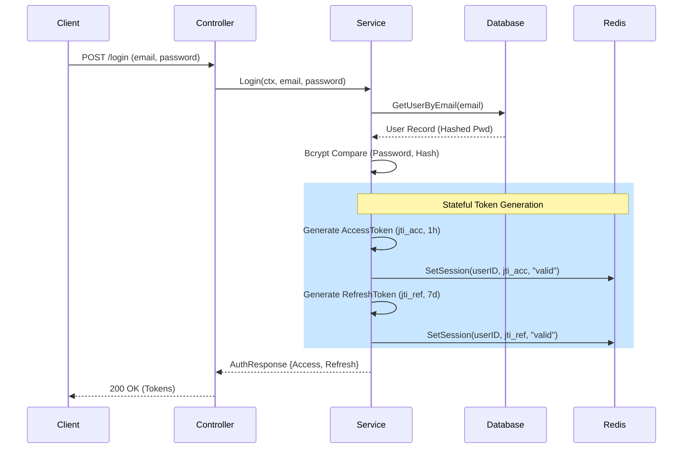
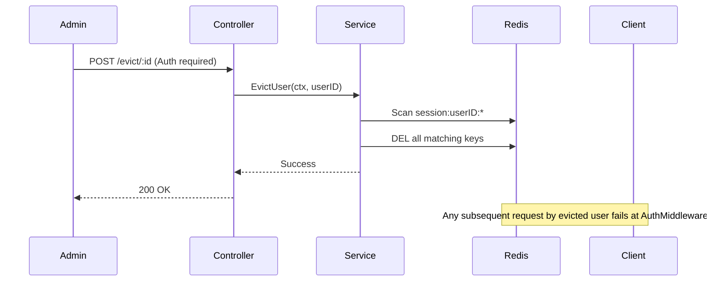

# Authentication & Stateful Session Flow

This document describes the stateful JWT architecture implemented in the `go-template` project. It ensures security through short-lived access tokens and longer-lived, revocable refresh tokens.

## 1. Login Flow

## 2. Refresh Token Flow

This flow allows the client to get a new **Access Token** without asking for credentials again.

*   **Validation**: The server checks the signature of the Refresh Token AND validates its `JTI` against Redis.
*   **Rotation**: The existing Refresh Token remains valid (or can be rotated), but a new Access Token is always issued with a fresh `jti`.

## 3. Evict User Flow

Used for security incidents (revoking access immediately).

## 4. Middleware Enforcement

On **every** protected request:
1.  **Parse**: JWT signature is verified.
2.  **Expiration**: Standard JWT expiration check.
3.  **State Check**: The middleware calls `redis.IsSessionValid(userID, jti)`. 
4.  **Action**: If the key is missing in Redis (deleted via `/logout` or `/evict`), the request is rejected with `401 Unauthorized`.
