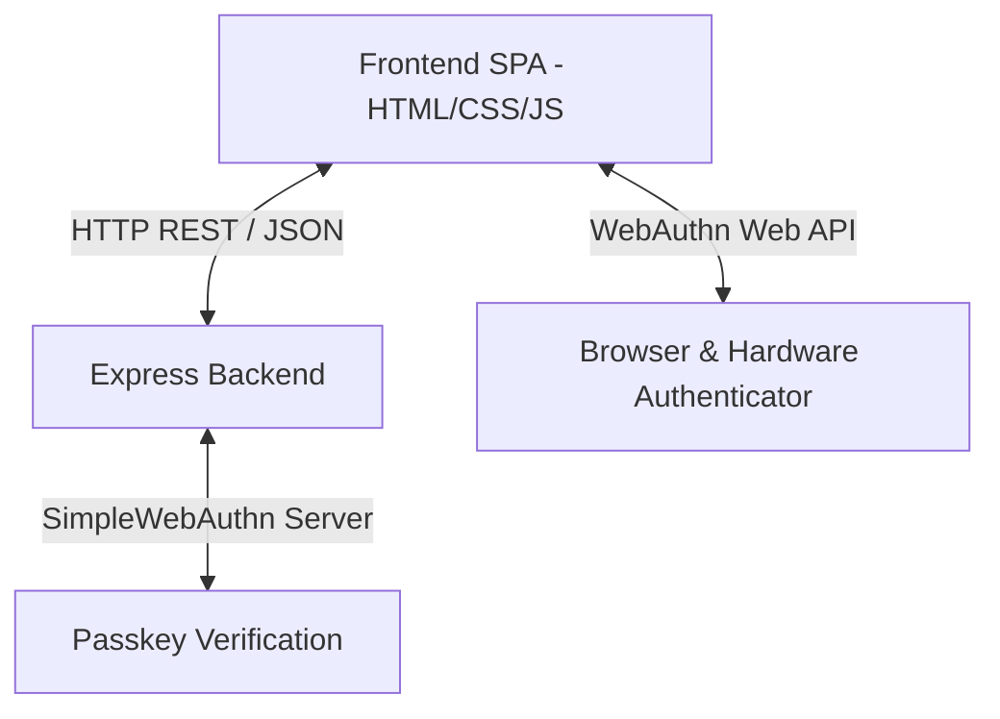
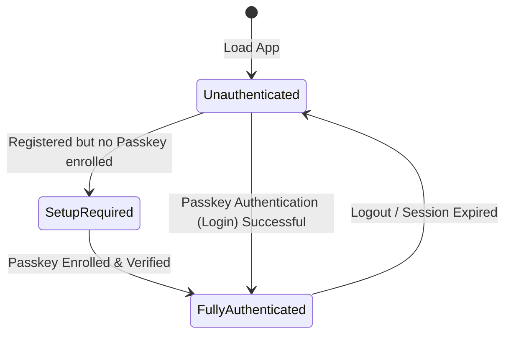
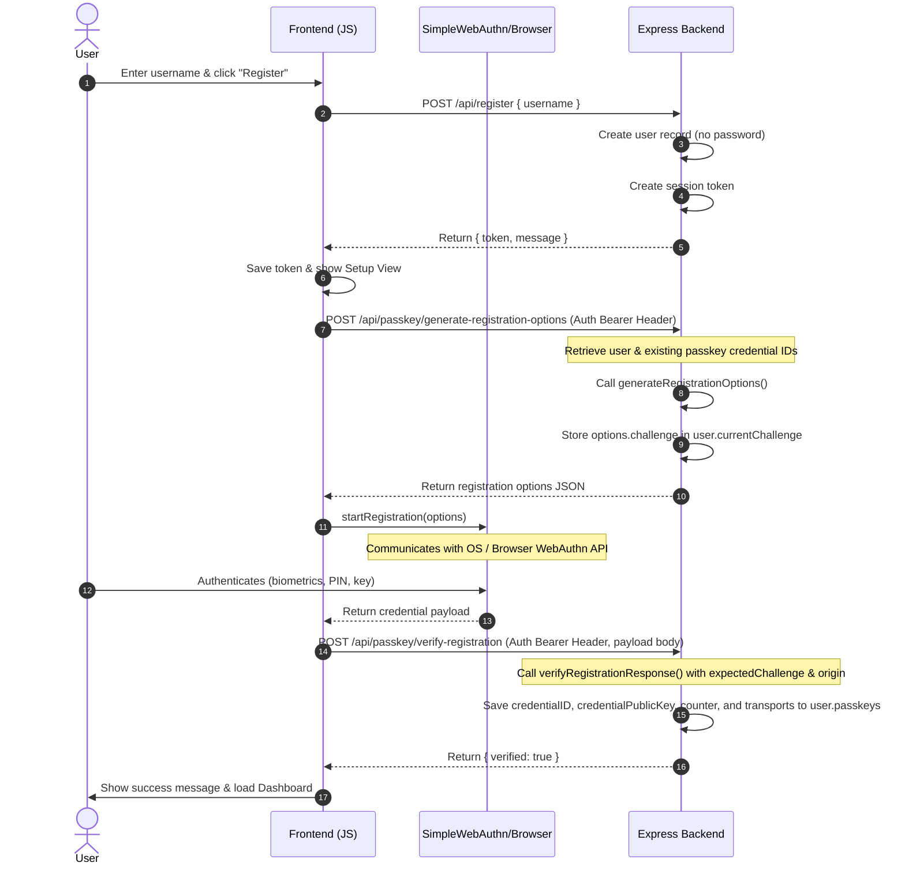
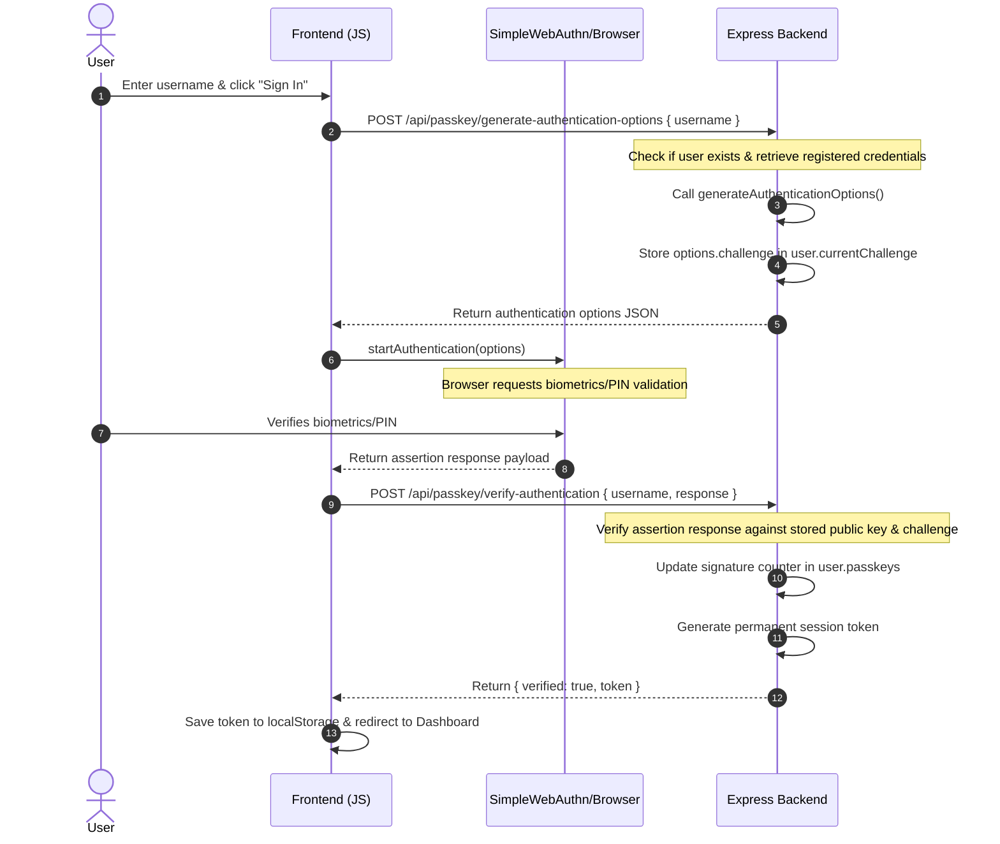

# Passwordless Passkey (WebAuthn) Demo Application

This project is a complete demonstration of a **passwordless authentication** flow using Passkeys (WebAuthn). Users register and sign in using cryptographically secure biometrics (e.g., Touch ID, Face ID), device PINs, or physical security keys (e.g., YubiKeys) instead of traditional passwords.

---

## 🏗️ Architecture

The application is structured as a single-page application (SPA) frontend served by a local Node.js Express server. It implements a passwordless registration, enrollment, and assertion (sign-in) sequence.

### 1. Key Component Interactions



### 2. In-Memory Data Store

To keep the demo lightweight and run-ready, the backend utilizes in-memory JavaScript objects as its data store:

*   `users`: Stores user identification and registered passkey credentials, keyed by username:
    ```javascript
    users[username] = {
        id: "base64url-uuid",          // Cryptographically secure user ID
        currentChallenge: "challenge", // Active WebAuthn challenge for registration/auth
        passkeys: [                    // List of credentials enrolled by the user
            {
                credentialID: Uint8Array,
                credentialPublicKey: Uint8Array,
                counter: number,
                transports: string[]
            }
        ]
    }
    ```
*   `sessions`: Map of active, fully authenticated tokens to usernames:
    ```javascript
    sessions[token] = username;
    ```

### 3. Authentication State Transitions

Access control is managed by transitioning clients through three specific states:



*   **Unauthenticated**: The client has no session tokens. Access to the dashboard or security setup views is blocked.
*   **SetupRequired**: The user has registered their username but has not yet associated a passkey device. They hold a session token, but the dashboard returns a `403 Forbidden` until a passkey verification is successfully registered.
*   **FullyAuthenticated**: The user has enrolled at least one passkey and authenticated. They can access the secure dashboard.

---

## 🔄 Code Flow Details

### 1. Registration & Passkey Enrollment Flow

Since this is a passwordless application, registration acts as a preliminary step to establish a username, which must immediately be linked to a cryptographic credential (passkey).



1. **User Creation**: The user submits their `username` via `POST /api/register`. The backend initializes a user entry with a generated ID and an empty passkeys list. An active session token is generated so the client can perform the initial passkey registration.
2. **Retrieve Registration Options**: The frontend calls `POST /api/passkey/generate-registration-options` with the temporary authorization token. The server configures the options:
    *   `rpID` and `rpName` identify the Relying Party (application).
    *   `authenticatorSelection` is set to prefer `residentKey` (for passwordless flows) and `platform` authenticators (like Touch ID/Face ID/Windows Hello).
    *   `challenge` is a cryptographically random buffer stored in the user's record to prevent replay attacks.
3. **Client-Side Attestation**: The frontend passes these options to the browser's WebAuthn API using `SimpleWebAuthnBrowser.startRegistration(options)`. The browser prompts the user for local authentication (biometrics or device PIN) and creates a public/private key pair unique to this domain.
4. **Verification and Enrollment**: The frontend submits the credential payload to the backend via `POST /api/passkey/verify-registration`. The backend verifies the signature against the challenge using `verifyRegistrationResponse()`. If verified, the public key, credential ID, signature counter, and transport types are saved. The user is now fully registered.

---

### 2. Passwordless Sign-In Flow



1. **Request Assertion Challenge**: The user enters their username and clicks **Sign In**. The frontend calls `POST /api/passkey/generate-authentication-options` containing the username.
2. **Options Response**: The server retrieves the user's registered credential IDs and calls `generateAuthenticationOptions()`, formatting them into the `allowCredentials` array. It saves a new challenge to the user record and sends the options back to the frontend.
3. **Hardware Sign-off**: The frontend invokes `SimpleWebAuthnBrowser.startAuthentication(options)`. The browser prompts the user to sign the challenge using their registered passkey. The private key on the device generates a signature.
4. **Signature Verification**: The assertion response is sent to `POST /api/passkey/verify-authentication`. The server:
    *   Locates the stored passkey matching the credential ID from the client response.
    *   Verifies the signature using the stored public key, the active challenge, and the origin domain via `verifyAuthenticationResponse()`.
    *   Verifies that the client's signature counter is greater than the stored counter.
    *   **Success**: The counter is updated, a permanent session token is generated and recorded, and the token is returned to the client to complete sign-in.

---

## 🔒 Security Enforcement

*   **Cloning & Replay Protection**:
    The authenticator counter tracks the number of times a credential has been used. The backend checks that the counter returned by the client is higher than the one stored. A smaller or equal counter indicates that the key may have been duplicated or a message replayed, causing the server to reject the session.
*   **Password-Free Storage**:
    Because the server stores no passwords (not even hashes), database breaches do not expose user credentials. The server only holds the public keys, which are useless to an attacker without the corresponding private key stored in the user's device hardware secure enclave.

---

## 🚀 Running the Application Locally

1. Install dependencies inside the backend folder:
   ```bash
   cd backend
   npm install
   ```
2. Start the server:
   ```bash
   node server.js
   ```
3. Open [http://localhost:3000](http://localhost:3000) in your web browser.
